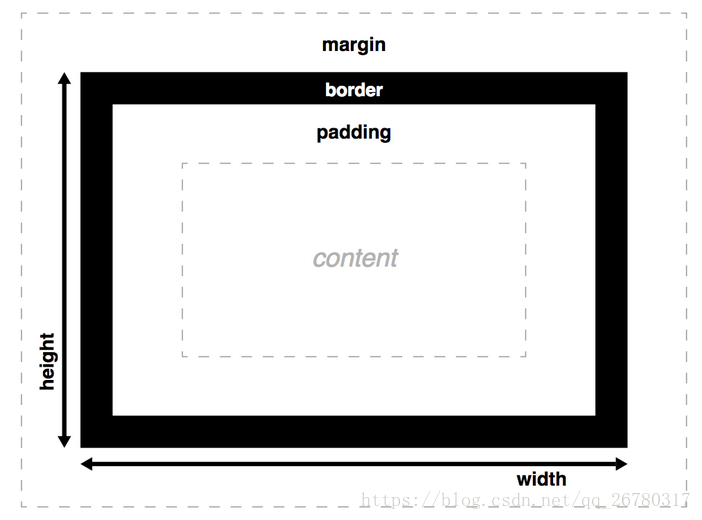

**当已经设定了width和height值的时候，padding和border不被包含在你定义的width和height之内，也就是说，你定义的width只负责content区域的宽度，如果想得到整个盒子宽度，需要再加上padding和border的厚度**

### margin-bottom

下外边距

| 值       | 描述                                                         |
| :------- | :----------------------------------------------------------- |
| auto     | 浏览器计算下外边距。                                         |
| *length* | 规定以具体单位计的下外边距值，比如像素、厘米等。默认值是 0px。 |
| *%*      | 规定基于父元素的宽度的百分比的下外边距。                     |
| inherit  | 规定应该从父元素继承下外边距。                               |

### elementUI

#### 分栏间隔

 Row 组件 提供 `gutter` 属性来指定每一栏之间的间隔，默认间隔为 0 

#### offset

 通过制定 col 组件的 `offset` 属性可以指定分栏偏移的栏数 

### &

 跟this的意思一样 

~~~css
.el-row {
    margin-bottom: 20px;
    &:last-child {
      margin-bottom: 0;
    }
  }
等同于
.el-row {
    margin-bottom: 20px;
    .el-row:last-child {
      margin-bottom: 0;
    }
  }
~~~

###  last-child 

 选择器用来匹配父元素中最后一个子元素 

### 居中

https://blog.csdn.net/mars2009/article/details/79683924

### css3计算高度/宽度

1 px

2 百分比

3、Viewport
  viewport：可视窗口，也就是浏览器。
  vw Viewport宽度， 1vw 等于viewport宽度的1%
  vh Viewport高度， 1vh 等于viewport高的的1%

4 Calc

使用“+”、“-”、“*” 和 “/”四则运算；
    >可以使用百分比、px、em、rem等单位；
    >可以混合使用各种单位进行计算；
    >表达式中有“+”和“-”时，其前后必须要有空格，如"widht: calc(12%+5em)"这种没有空格的写法是错误的；

**表达式中有“*”和“/”时，其前后可以没有空格，但建议留有空格**

例如 ：设置div元素的高度为当前窗口高度-100px
   div{
    height: calc(100vh - 100px);   
  }

### display

display:none;--此元素不会被显示

#### 元素选择器、

**多个元素选择器用逗号隔开**

#### *

通配选择器，该选择器可以匹配任何元素，就像是一个通配符

#### ~

~~~css
p~ul{
　　background:#ff0000;
}
// 为所有相同的父元素中位于 p 元素之后的所有 ul 元素设置背景
~~~

### box-sizing

https://blog.csdn.net/qq_26780317/article/details/80736514

未加入box-sizing前的模型

加入box-sizing

### Outline

一个框的outline是一个看起来像是边界但又不属于框模型的东西。它的行为和边界差不多，但是并不改变框的尺寸（更准确的说，轮廓被勾画于在框边界之外，外边距区域之内）

