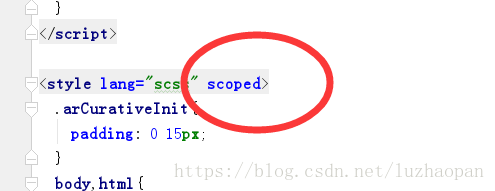

### icon

~~~html
// slot属性必填,否则icon属性不生效
<el-button icon="el-icon-search" slot="append"></el-button>
~~~

### <el-card 

###  <el-dialog

https://blog.csdn.net/mr_javascript/article/details/80888681

弹框出现遮罩层的解决办法:

 :modal="false"属性取消遮罩层或者添加append-to-body属性 

###  slot-scope="scope" 

### <el-table

**内置scope对象,score对象有row属性，row对象通过$index来获取当前表格当前行的下标**

**注意,scope对象要在<el-table标签下传参才有效**

例子

~~~vue
<template>
	<el-form>
    	<el-form-item>
            <el-table>
                ...
                <el-table-column>
					<template>
                        <!--scope对象只有在<el-table>环境下才有效  -->
                        <el-button @click="deleteRow(scope.$index)"></el-button>
					</template>
    			</el-table-column>
				<el-table-column prop="xxx" :label="列名">
                    <template>
						//属性绑定是scope.row.fieldName来进行属性绑定
						<el-input v-model="scope.row.fieldName" />
                    </template>
				</el-table-column>
                ...
    		</el-table>
    	</el-form-item>
	</el-form>
</template>

~~~

### :的作用

element ui组件:就会把属性当做一个变量来处理

例子:

~~~vue
...
// 这里直接显示$t('messge')
<el-table label="$t('messge')"></el-table>
// :label相当于一个变量，可以读取messge变量
<el-table :label="$t('messge')"></el-table>
...

~~~

### div/img的宽度自适应

设置width的值是百分比，div的高度作为父级元素，高度由子元素撑开

### <el-select

在element-ui中，需求可输入下拉。

设置filterable为true，设置为可搜索，但是当鼠标离开的时候输入框会被置空。

因为没有找到匹配项。可通过blur事件重设当前值

~~~vue
<el-select v-model="value" filterable placeholder="请选择" @blur="selectBlur"></el-select>

data() {
	return {
		value: ''
	}
},
methods: {
	searchBlur(e) {
		this.value = e.target.value
	}
}
~~~

### <el-table

1 锁定列的实现

~~~xml
<!-- 在el-table-column增加fixed即可锁定列,同时设置height为100%  -->
<el-table height="100%" >
<el-table-column
                        fixed
                        prop="collumn1"
                        :label="collumn1"
                        width="200"
                        header-align="left"
                        align="left"
                        >
                    </el-table-column>
~~~

2 滚动条的出现

**滚动条的出现需要设置高度,注意高度的设置方式**

~~~vue
<!-- 注意:style="height:100%" 和heght="100%"效果是不一样的-->
<el-table border :data="list" style="width: 100%"  height="100%">
~~~

### <el-tab 修改字体样式

el-tabs 的选项卡字体默认大小为 14px ，想修改它的大小，一般的方法就是重写 el-tabs__item 该类的样式，在加个**！important** ，它的样式就会被重写

~~~css
.el-tab__item{
    font-size:16px !important;
    color:#00000;
    margin-left:-14px;
}
~~~

但发现它的样式并没有覆盖，字体的样式还是原来的样式，百思不得其解，废了好多精力，终于找到了罪归祸首，那就是 scope，我在我的style标签里加入了这个标签属性，无论怎么重写，样式都没有被改变，把其去掉了之后，重写的样式终于起效了，其中的深意我也不得其解，如果你们也有类似的问题，希望能帮助到你们

### app

~~~css
#app, html {
    height: 100%;
}
~~~

