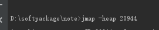
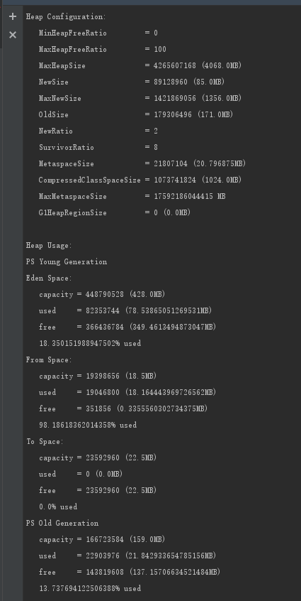
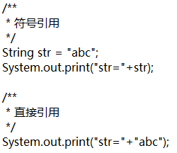

**classLoader可以作为GCRoot**

### 内存结构

#### 1 堆内存

**静态变量存放在堆中，不是元空间,验证方法是在定义一个常量的大对象或静态变量的大对象，然后调低堆内存的最大值**

堆内存细分


新生代和老年代默认是1:2

-XX:NewRatio=4,新生代占比是1，老年代占比是4

堆内存动态变化

（1）-XX:MinHeapFreeRatio 参数用于设置堆空间的最小空闲比率。默认值是40，当堆空间的空闲内存比率小于40，JVM便会扩展堆空间


（2）-XX:MaxHeapFreeRatio 参数用于设置堆空间的最大空闲比率。默认值是70， 当堆空间的空闲内存比率大于70，JVM便会压缩堆空间。

**当-Xmx和-Xmx相等时，上面两个参数无效**

#### 2 本地方法栈

（1）调用本地native的内存模型。


（2）线程独享。

#### 3 虚拟机栈

虚拟机栈是Java执行方法的内存模型。每个方法被执行的时候，都会创建一个栈帧，把栈帧压人栈，当方法正常返回或者抛出未捕获的异常时，栈帧就会出栈

栈帧：栈帧存储方法的相关信息，包含局部变量表、返回值、操作数栈、动态链接

1 局部变量表:局部变量表：包含了方法执行过程中的所有变量。局部变量数组所需要的空间在编译期间完成分配，在方法运行期间不会改变局部变量数组的大小

#### 4 程序计数器

指向当前线程正在执行的字节码指令。线程私有的

#### 5 元空间

  不在虚拟机中，在直接内存中

1 存放加载的类的元数据


### 垃圾判断算法

1 引用计数法

给对象添加一个计数器，当一个地方引用则加，引用失效则减1，当计数器的值为0则对象失效

2 可达性分析法

从GC Root 对象往下搜索，当一个对象到GC root没有任何引用链相连则不可达

#### GC Root

1 虚拟机栈(栈帧中的局部变量区，也叫局部变量表)中引用的对象

2 方法区中静态属性引用的对象

3 方法去常量引用对象

4 本地方法栈中JNI(native方法)引用的对象

### jvm 参数

**多个jvm参数使用空格隔开**


#### 1 标配参数

##### -Xms

-Xms等价于-XX:InitialHeapSize

##### -Xmx

-Xmx等价于-XX:MaxHeapSize

##### -Xss

-Xss等价于-XX:ThreadStackSize。设置每个线程栈的大小，一般默认是512k-1024k

**-Xss的用法: -Xss128k**


Xss官网解释


##### -Xmn

-Xmn:年轻代的大小

##### -XX:MetaspaceSize

设置元空间的大小，元空间直接使用本地内存，不在jvm之中

**b是字节**,比	特是表示信息的最小单位

元空间默认大小是21807104b

java.lang.OutofMemoryError:Metaspace

#### 2 x参数(了解)

#### 3 xx参数(重点)

##### 3.1 布尔类型(boolean)

​	 -XX:+(-)属性值--其中+表示开启，-表示关闭

##### 3.2 KV设置类型

公式:-XX:属性key=属性value

~~~ shell
jinfo -flag MetespaceSize 5148
~~~


##### 3.3 jinfo

jinfo举例,如何查看当前运行程序的配置

 jps -l

**jps也可以在linux环境使用**

**重要命令:jinfo -flags pid**

#### jinfo实时修改jvm参数(java -XX:+PrintFlagsFinal命令打印出来是manageable才能实时修改)

**jinfo -flag name=value pid**

jinfo的使用

**查看某个参数**

公式;jinfo -flag  属性名  pid

~~~properties
// 查看 MetaspaceSize的大小
jinfo  -flag MetaspaceSize 16656
~~~


##### 3.4 使用串行垃圾回收器

-XX:+UseSerialGC


#### 4 command line

command line是指自己加的jvm参数


### jvm 默认参数查看第二种方法

java -XX:+PrintFlagsInitial -- 查看初始默认值，即没有被人为修改过的

java -XX:+PrintFlagsFinal  --主要查看修改更新之后的参数


##### 说明

没有冒号说明是初始值，即没有被人为修改过，有冒号说明被人为修改过

打印出来的堆内存大小的单位是byte

1 Byte= 8 bit

1 KB=1024Byte


### jvm参数查看第三办法

java -XX:+PrintCommandLineFlags  --- 第三方办法


### printGCDetails


#### GC

#### minor GC

发生在新生代GC

#### mojar GC

发生老年代的GC

#### Full GC

整个堆

#### gc日志

 [PSYoungGen: 2552K->504K(2560K)] 3068K->1339K(9728K), 0.0006765 secs] [Times: user=0.00 sys=0.00, real=0.00 secs] 

**[PSYoungGen: 504K->504K(2560K)] 2311K->2367K(9728K):PSYoungGen区GC前是504k,GC后是504k，总大小是2560k, 2311K->2367K(9728K):堆内存在GC前是2311k,GC后是2367K,堆的总大小是9728k**


~~~ shell
// 表明本次引起GC的原因是因为在年轻代中没有足够的空间能够存储新的数据了
[GC (Allocation Failure) [PSYoungGen: 2048K->504K(2560K)] 2048K->1020K(9728K), 0.0027086 secs] [Times: user=0.00 sys=0.00, real=0.00 secs] 
[GC (Allocation Failure) [PSYoungGen: 2552K->504K(2560K)] 3068K->1339K(9728K), 0.0006765 secs] [Times: user=0.00 sys=0.00, real=0.00 secs] 
[GC (Allocation Failure) [PSYoungGen: 2552K->504K(2560K)] 3387K->1971K(9728K), 0.0009407 secs] [Times: user=0.00 sys=0.00, real=0.00 secs] 
initHeapSize9961472字节,9M
maxHeapSize9961472字节,9M
[GC (Allocation Failure) [PSYoungGen: 2179K->504K(2560K)] 3647K->2311K(9728K), 0.0010163 secs] [Times: user=0.00 sys=0.00, real=0.00 secs] 
--  [PSYoungGen: 504K->504K(2560K)] 2311K->2367K(9728K):PSYoungGen区GC前是504k,GC后是504k，总大小是2560k, 2311K->2367K(9728K):堆内存在GC前是2311k,GC后是2367K,堆的总大小是9728k
-- [Times: user=0.00 sys=0.00, real=0.00 secs]-- user:用户耗时,sys:系统耗时，real:真实耗时
[GC (Allocation Failure) [PSYoungGen: 504K->504K(2560K)] 2311K->2367K(9728K), 0.0004441 secs] [Times: user=0.00 sys=0.00, real=0.00 secs] 
[Full GC (Allocation Failure) [PSYoungGen: 504K->0K(2560K)] [ParOldGen: 1863K->1869K(7168K)] 2367K->1869K(9728K), [Metaspace: 3536K->3536K(1056768K)], 0.0089646 secs] [Times: user=0.11 sys=0.00, real=0.01 secs] 
[GC (Allocation Failure) [PSYoungGen: 0K->0K(1536K)] 1869K->1869K(8704K), 0.0002946 secs] [Times: user=0.00 sys=0.00, real=0.00 secs] 
[Full GC (Allocation Failure) [PSYoungGen: 0K->0K(1536K)] [ParOldGen: 1869K->1810K(7168K)] 1869K->1810K(8704K), [Metaspace: 3536K->3536K(1056768K)], 0.0128252 secs] [Times: user=0.11 sys=0.00, real=0.01 secs] 
Heap
~~~

###  survivorRatio

-XX:survivorRatio=8   ---设置eden区和survivorRatio From survivorRatio to 的比例,默认是8:1:1


### -XX:MaxTenuringThreshold

设置垃圾的最大年龄，如果设置为0，则年轻代对象不经过suvivor去，直接进入老年代，如果此值设置比较大，则年轻代对象会在survivor区进行多次复制，这样可以增加对象在年轻代的存活时间，增加在年轻代被回收的概率

**最大值是15**,值的范围是0-15


### OOM

##### stackOverflowError

虚拟机栈内存爆满

例子1 递归调用没有跳出循环的条件或或者递归调用有比较大对象

#### OutofMemoryError:heap space

堆内存爆满

#### overhead limit exceeded

GC回收时间过长或者GC回收效果不明显，导致频繁GC

### 查看默认的GC回收器

java -XX:+PrintCommandLineFlags


### 垃圾收集器

#### 1 串行垃圾收集器

-XX:+UseSerialGC

1 在垃圾收集过程中所有工作线程都会停止

2 没有线程的交互，简单高效

开启后新生代使用Serial+SerialOld(老年代)

表示新生代和老年代都是串行收集器，新生代使用复制算法，老年代使用标记-整理法

### 2 ParNew收集器

-XX:+UseParaNewGC,启用ParNew收集器，只影响新生代收集器，不影响老年代收集器

开启这个参数使用新生代用ParNewGC收集器，老年代用SerialOld收集器

### 3 Parallel收集器(parallel scavenge)

-XX:+UseParallelGC或-XX:+UseParallelOldGC**可以互相激活**

使用复制算法，并行的多线程收集器，吞吐量垃圾收集器

吞吐量=运行用户代码时间/运行用户代码时间+垃圾收集时间

有两个参数控制吞吐量

1 -XX:MaxGCPauseMillis:设置一个大于0的毫秒数，这个是GC垃圾回收的最大停顿时间，但不一定不超时

2 -XX:GCTimeRatio:设置一个垃圾回收时间的比例，等于加一个倒数，例如比值是19,则垃圾回收是1/(1+19)

3 -XX:ParallelGCThreads=3--启动3个线程回收垃圾，**当cpu>8，实际线程数等于3/8,cpu<8,就是实际数**


线程池，多线程,mybatis,spring cloud常用属性


### 4 G1收集器

-XX:+UseG1GC

**标记整理算法，局部是复制算法**

G1是一种服务端垃圾收集器，在实现高吞吐量 的同时，尽可能的满足垃圾收集暂停时间的要求，具有以下特性

1 能与应用程序并发执行

2 整理空闲空间更快

3 需要更多时间预测GC停顿时间

**主要改变是Eden、suvivor和Tenured等内存区域不再是连续，而是变成了一个个大小一样的region，每个region从1M到32M不等，一个region可能是Eden、Suvivor或Tenured**

调优官方建议

1 调整Xmn和-XX:NewRatio的比例

2 Pause Time Goals:

3 Taming Mixed Garbage Collections:

### 对象进入老年代参数

-XX:PretenureSizeThreshold设置大对象直接进入年老代的阈值，当对象大小超过这个值时，将直接在年老代分配。默认值是0

-XX:MaxTenuringThreshold是给Serial收集器和没有开启UseAdaptiveSizePolicy的ParNew GC收集器用的(`在计算存活周期这个阈值时，hotspot会遍历所有age的table，并对其所占用的大小进行累积，当累积的大小超过了survivor space的一半时，则以这个age作为新的存活周期阈值，最后取age和MaxTenuringThreshold中更小的一个值。`)


### GC参数

-Xms9m -Xmx9m -XX:+PrintGCDetails -XX:MetaspaceSize=10m -XX:MaxMetaspaceSize=10m


### CAS

比较并替换，将传入的值和真实值比较，相同则更新值，不相同则不更新

cas是一种系统原语，原语属于操作系统用语范畴，是由若干条指令组成的，用于完成某个功能的一个过程，并且原语的执行必须是连续的，在执行过程不会被打断，不会造成所谓的数据不一致的问题，这是一个依赖于硬件实现的功能

**CAS是一条CPU的原子指令**


缺点:循环时间长，资源消耗大

#### ABA问题

问题1  线程1从堆内存读取一个共享变量x的值是A,线程2从堆内存读取共享变量x的是A,然后线程2将是改为B，再然后线程2又把变量x的值改为A，这个时候线程1从将栈内存的值A和堆内存的值比较都是A，两者相等，线程1更新变量x的值

解决办法

1 引入AtomicReference(原子引用)

2 加入版本号

### 大对象进入老年代条件

1 对象大小大于Eden区的总大小

2 超过PretenureSizeThreshold的值，默认值是0

### 老年代爆满优化

https://blog.csdn.net/wzygis/article/details/83589764

### jstat

S0 年轻代中第一个survivor（幸存区）已使用的占当前容量百分比

S1 年轻代中第二个survivor（幸存区）已使用的占当前容量百分比

E 年轻代中Eden（伊甸园）已使用的占当前容量百分比

O old代已使用的占当前容量百分比

P perm代已使用的占当前容量百分比

YGC 从应用程序启动到采样时年轻代中gc次数

YGCT 从应用程序启动到采样时年轻代中gc所用时间(s)

FGC 从应用程序启动到采样时old代(全gc)gc次数

FGCT 从应用程序启动到采样时old代(全gc)gc所用时间(s)

GCT 从应用程序启动到采样时gc用的总时间(s)

```shell
jstat -gc 10365
 S0C    S1C    S0U    S1U      EC       EU        OC         OU       MC     MU    CCSC   CCSU   YGC     YGCT    FGC    FGCT     GCT   
10752.0 10752.0  0.0   4340.5 65536.0  23922.5   175104.0    144.0    17152.0 16426.6 2048.0 1907.5      1    0.004   0      0.000    0.004
```

SOC、S1C、S0U、S1U S0和S1的总量与使用量  EC、EU Eden区的总量与使用量  OC、OU Old区的总量与使用量  MC、MU Metaspace的总量与使用量  CCSC、CCSU 压缩类空间总量与使用量  YGC、YGCT YoungGC的次数与时间  GGC、FGCT FullGC的次数与时间  GCT 总的GC时间

### 设置jvm参数

1 idea、eclipse

2 java -XX:+UseG1GC xxx.jar

**3 tomcat --->bin-->xxx.sh/catalina.sh**

4 jinfo

5 设置环境变量JAVA_OPTS

### jstat

打印加载的类的信息

例如:

~~~shell
jstat -class pid 1000 10 //1000毫秒总共打印10次
~~~

打印gc收集的信息

~~~shell
jstat - gc pid 1000 10 //1000毫秒总共打印10次
~~~


### jstack

查看线程的堆栈信息

jstack PID

如果线程出现问题，方便排查那个线程出了什么问题

**分析死锁很有用**

### jmap

查看堆内存的信息

jmap -heap PID



命令结果：



获取dump文件

1. JVM启动时增加两个参数:

   ~~~properties
   #出现 OOME 时生成堆 dump: 
   -XX:+HeapDumpOnOutOfMemoryError
   #生成堆文件地址：
   -XX:HeapDumpPath=/home/liuke/jvmlogs/
   ~~~

2. 发现程序异常前通过执行指令，直接生成当前JVM的dmp文件

   ~~~shell
   jmap -dump:format=b,file=/home/admin/logs/heap.hprof 6214
   ~~~

jmap dump:format=b,file=heap.hprof  PID

**format=b指定为二进制格式文件**

自动生成dump文件的参数

-XX:+HeapDumpOnOutOfMemoryError -XX:HeapDumpPath=heap.hprof

### 运行模式的修改

1 java -Xint  -version

​    解析执行

2 java -Xcomp  -version

   编译模式

3 java -Xmixed -version

   混合模式

### dump文件

jvisualvm可以打开dump文件

### 打印GC回收时间

**GC日志和dump文件不一样，GC日志是gc回收对象的信息**

-XX:+PrintGCDetails -XX:+PrintGCTimeStamps -XX:+PrintGCDateStamps

工具

### GC类型

Minor GC:年轻代满了

Major GC触发条件：回收老年代，通常至少经历过一次Minor GC

Full GC:回收整个堆

https://blog.csdn.net/qq_38384440/article/details/81710887

### 调优案例

1 调大堆内存--停顿时间变长，gc次数减少

2 设置GC的最大停顿时间

3 调整堆的使用比例触发堆内存的GC

### G1 VS CMS

1 

 CMS --标记清除算法--产生碎片

 G1-- 标记整理算法--整理空间碎片

2 

 G1 拆分成很多区域--首先收集垃圾比较多的区域

3 

G1要求内存空间是6G以上

4 

RSet

 5

CSet,存活对象移动到另外分区 CSet  <1%


### 符号引用VS直接引用


例子1 

在类的加载过程中的解析阶段，Java虚拟机会把类的二进制数据中的符号引用 替换为 直接引用，如Worker类中一个方法：

```
public void gotoWork(){
     car.run(); //这段代码在Worker类中的二进制表示为符号引用        
}
```

在Worker类的二进制数据中，包含了一个对Car类的run()方法的符号引用，它由run()方法的全名 和 相关描述符组成。在解析阶段，Java虚拟机会把这个符号引用替换为一个指针，该指针指向Car类的run()方法在方法区的内存位置，这个指针就是直接引用

符号引用即用用字符串符号的形式来表示引用，其实被引用的类、方法或者变量还没有被加载到内存中。而直接引用则是有具体引用地址的指针，被引用的类、方法或者变量已经被加载到内存中。以变量举个例子：



符号引用要转换成直接引用才有效，这也说明直接引用的效率要比符号引用高。那为什么要用符号引用呢？这是因为类加载之前，javac会将源代码编译成.class文件，这个时候javac是不知道被编译的类中所引用的类、方法或者变量他们的引用地址在哪里，所以只能用符号引用来表示，当然，符号引用是要遵循java虚拟机规范的。还有一种情况需要用符号引用，就例如前文举得变量的符号引用的例子，是为了逻辑清晰和代码的可读性。

我们都知道，类加载过程分为加载—>验证—>准备—>解析—>初始化这 5个阶段，符号引用转换为直接引用就发生在解析阶段，解析阶段可能在初始化前，也可能在初始化之后

直接引用可以是： 

1：直接指向目标的指针。（个人理解为：指向对象，类变量和类方法的指针）

2：相对偏移量。    （指向实例的变量，方法的指针）

3：一个间接定位到对象的句柄

例子

> User u = new User()

其中 u 就是一个句柄

### 双亲委派

对于任意一个类，都需要由**加载它的类加载器**和这个**类本身**来一同确立其在Java虚拟机中的**唯一性**

``` java
//用户自定义的类加载器不可能加载应该由父加载器加载的可靠类
```

**缺点:父级加载器无法加载子级类加载器路径中的类**

### 对象的创建过程

（1）虚拟机遇到一条new指令时，首先检查这个指令的参数能否在常量池中定位到一个类的符号引用，并检查这个符号引用代表的类是否已经加载、连接和初始化。如果没有，就执行该类的加载过程。


（2）为该对象分配内存。


A、假设Java堆是规整的，所有用过的内存放在一边，空闲的内存放在另外一边，中间放着一个指针作为分界点的指示器。那分配内存只是把指针向空闲空间那边挪动与对象大小相等的距离，这种分配称为“指针碰撞”


B、假设Java堆不是规整的，用过的内存和空闲的内存相互交错，那就没办法进行“指针碰撞”。虚拟机通过维护一个列表，记录哪些内存块是可用的，在分配的时候找出一块足够大的空间分配给对象实例，并更新表上的记录。这种分配方式称为“空闲列表“。


C、使用哪种分配方式由Java堆是否规整决定。Java堆是否规整由所采用的垃圾收集器是否带有压缩整理功能决定。


D、分配对象保证线程安全的做法：虚拟机使用CAS失败重试的方式保证更新操作的原子性。（实际上还有另外一种方案：每个线程在Java堆中预先分配一小块内存，称为本地线程分配缓冲，TLAB。哪个线程要分配内存，就在哪个线程的TLAB上分配，只有TLAB用完并分配新的TLAB时，才进行同步锁定。虚拟机是否使用TLAB，由-XX:+/-UseTLAB参数决定）


（3）虚拟机为分配的内存空间初始化为零值（默认值）


（4）虚拟机对对象进行必要的设置，例如这个对象是哪个类的实例、如何才能找到对象的元数据信息、对象的Hash码、对象的GC分代年龄等信息。这些信息存放在对象的对象头中。


（5） 执行方法，把对象按照程序员的意愿进行初始化。

### 日志

~~~properties
Metaspace used 2425K, capacity 4498K, committed 4864K, reserved 1056768K
class space used 262K, capacity 386K, committed 512K, reserved 1048576K
// committed和reserved
committed和reserved。reserved是指，操作系统已经为该进程“保留”的。所谓的保留，更加接近一种记账的概念，就是操作系统承诺说一大块连续的内存已经是你这个进程的了。注意的是，这里强调的是连续的内存，并且强调的是一种名义归属。那么实际上这一大块内存有没有真实对应的物理内存呢？答案是不知道。

那么什么时候才知道呢？等进程committed的时候。当进程真的要用这个连续地址空间的时候，操作系统才会分配真正的内存。所以，这也就是意味着，这个过程会失败。

举个例子来说，就好比杨白劳找黄世仁借粮，杨白劳说借我一百斤，黄世仁在本子上记录了一笔说可以，借给你了，但是现在不能给你，等你要吃的时候再来领。于是杨白劳过了一个星期，领了三十斤，这三十斤就是committed的，之前那一百斤就是reserved的。很显然，如果黄世仁给太多人都记了一笔，说不定等杨白劳去借的时候，就没有了
// used和capacity
used和capacity就是JVM的概念了。这两个概念非常接近JVM一些集合框架的概念。一些Java集合框架，比如某种List的实现，会有size和capacity的概念。比如说ArrayList的实现里面就有capacity和size的概念。假如说我创建了一个可以存放20个元素的ArrayList，但是我实际上只放了10个元素，那么capacity就是20，而size就是10.这里的size和used就是一个概念
~~~

### 逃逸

逃逸分析，是一种可以有效减少Java 程序中同步负载和内存堆分配压力的跨函数全局数据流分析算法。通过逃逸分析，Java Hotspot编译器能够分析出一个新的对象的引用的使用范围从而决定是否要将这个对象分配到堆上

逃逸定义:

当一个对象在方法中被定义后,它可能被外部方法引用，例如作为调用参数传递到其他方法中或返回值被引用，称为方法逃逸，被外部线程访问则是线程逃逸，当确认对象不会逃逸，则可以将对象在栈上分配对象

- 开启逃逸分析：-XX:+DoEscapeAnalysis
- 关闭逃逸分析：-XX:-DoEscapeAnalysis
- 显示分析结果：-XX:+PrintEscapeAnalysis


### 反射

最近新上线的系统偶尔会报FullGC时间过长（>1s）的告警，查看GC日志，如下图所示：


看到GC日志，我第一时间关注到的不是GC耗时，而是GC触发的原因：Metadata GC Threshold。也就是FullGC触发的原因是因为Metaspace大小达到了GC阈值。在监控系统里面看了一下Metaspace的大小变化趋势，如下图所示：


按照以往的经验，Metaspace在系统稳定运行一段时间后占用空间应该比较稳定才对，但是从上图来看，Metaspace显然是呈现大幅波动。为什么呢？

[b]相关知识[/b]

我们知道Metaspace主要存储类的元数据，比如我们加载了一个类，那么这个类的信息就会按照一定的数据结构存储在Metaspace中。Metaspace的大小和加载类的数目有很大关系，加载的类越多，Metaspace占用内存也就越大。

Metaspace被分配于堆外空间，默认最大空间只受限于系统物理内存。跟它相关的比较重要的两个JVM参数：

-XX:MetaspaceSize -XX:MaxMetaspaceSize

MaxMetaspaceSize大家从名字也能猜到是指Metaspace最大值，而MetaspaceSize可能就比较容易让人误解为是Metaspace的最小值，其实它是指Metaspace扩容时触发FullGC的初始化阈值，在GC后该值会被动态调整：如果本次GC释放了大量空间，那么就适当降低该值，如果释放的空间较小则适当提高该值，当然它的值不会大于MaxMetaspaceSize.

另外一个相关知识是：Metaspace中的类需要满足什么条件才能够被当成垃圾被卸载回收？条件还是比较严苛的，需同时满足如下三个条件的类才会被卸载：

1、该类所有的实例都已经被回收；

2、加载该类的ClassLoader已经被回收；

3、该类对应的java.lang.Class对象没有任何地方被引用。

[b]排查过程[/b]

我们可以回过头再细看GC日志，可以看出Metaspace已使用内存在FullGC后明显变小（372620K -> 158348K），说明Metaspace经过FGC后卸载了很多类。从这点来看，我们有理由怀疑系统可能在频繁地生成大量”一次性“的类，导致Metaspace所占用空间不断增长，增长到GC阈值后触发FGC。


那么这些被回收的类是什么呢？为了弄清楚这点，我增加了如下两个JVM启动参数来观察类的加载、卸载信息：

-XX:TraceClassLoading -XX:TraceClassUnloading

加了这两个参数后，系统跑了一段时间，从Tomcat的catalina.out日志中发现大量如下的日志：


到此基本可以确定Metaspace增长的元凶是这些类，那么这些类sun.reflect.GeneratedSerializationConstructorAccessorXXX是干嘛的呢？又是从哪里引进来的呢？我也是一脸懵逼~~

根据类名Google了一把，找到了@寒泉子写的《从一起GC血案谈到反射原理》，这篇文章对这些类的来源解释得很透彻。在这里我简单总结如下：

[code=java]

Method method = XXX.class.getDeclaredMethod(xx,xx);

method.invoke(target,params);

[/code]

**重点内容开始**

这些类的来源是来自反射，类似上面所示的反射代码应该大家都写过或者看过，我们常用的大多数框架比如Spring、Dubbo等都大量使用反射。出于性能的考虑，JVM会在反射代码执行一定次数后，通过动态生成一些类来将”反射调用”变为“非反射调用”，以达到性能更好。而这些动态生成的类的实例是通过软引用SoftReference来引用的。

我们知道，一个对象只有软引用SoftReference，如果内存空间不足，就会回收这些对象的内存；如果内存空间足够，垃圾回收器不会回收它。只要垃圾回收器没有回收它，该对象就可以被使用。那么究竟在什么时候会被回收呢？

SoftReference中有一个全局变量clock代表最后一次GC的时间点，有一个属性timestamp，每次访问SoftReference时，会将timestamp其设置为clock值。

当GC发生时，以下几个因素影响SoftReference引用的对象是否被回收：

1、SoftReference对象实例多久未访问，通过clock - timestamp得出对象大概有多久未访问；

2、内存空闲空间的大小；

3、SoftRefLRUPolicyMSPerMB常量值；

是否保留SoftReference引用对象的判断参考表达式，true为不回收，false为回收：

clock - timestamp <= freespace * SoftRefLRUPolicyMSPerMB

说明：

clock - timestamp：最后一次GC时间和SoftReference对象实例timestamp的属性的差。就是这个SoftReference引用对象大概有多久未访问过了。

freespace：JVMHeap中空闲空间大小，单位为MB。

SoftRefLRUPolicyMSPerMB：每1M空闲空间可保持的SoftReference对象生存的时长（单位ms）。这个参数就是一个常量，默认值1000，可以通过参数：-XX:SoftRefLRUPolicyMSPerMB进行设置。

**重点内容结束**

查看了一下我们系统的JVM参数配置，发现我们把SoftRefLRUPolicyMSPerMB设置为0了，这样就导致软引用对象很快就被回收了。进而导致需要频繁重新生成这些动态类。

为了验证这个猜测，我把SoftRefLRUPolicyMSPerMB改成了6000进行观察，发现果然猜得没错。系统启动后不久Metaspace的使用空间基本保持不变了，运行几天后也没再出现因为Metaspace大小达到阈值而触发FGC。至此问题解决。

### 个人优化记录

#### 1

-Xms2048m -Xmn11400m

1服务在启动的时候GC日志

~~~properties
[GC (Allocation Failure) [PSYoungGen: 65536K->6358K(76288K)] 65536K->6374K(251392K), 0.0052862 secs] [Times: user=0.00 sys=0.00, real=0.00 secs] 
[GC (Allocation Failure) [PSYoungGen: 71894K->7191K(76288K)] 71910K->7215K(251392K), 0.0046049 secs] [Times: user=0.00 sys=0.00, real=0.01 secs] 
[GC (Allocation Failure) [PSYoungGen: 72727K->9076K(76288K)] 72751K->9172K(251392K), 0.0056289 secs] [Times: user=0.00 sys=0.00, real=0.01 secs] 
[GC (GCLocker Initiated GC) [PSYoungGen: 13983K->5935K(141824K)] 14079K->6039K(316928K), 0.0035536 secs] [Times: user=0.00 sys=0.00, real=0.00 secs] 
[GC (Metadata GC Threshold) [PSYoungGen: 11884K->6159K(141824K)] 11988K->6271K(316928K), 0.0043844 secs] [Times: user=0.00 sys=0.00, real=0.00 secs] 
[Full GC (Metadata GC Threshold) [PSYoungGen: 6159K->0K(141824K)] [ParOldGen: 112K->6060K(81408K)] 6271K->6060K(223232K), [Metaspace: 20902K->20902K(1069056K)], 0.0298114 secs] [Times: user=0.08 sys=0.02, real=0.03 secs]
~~~

  首先看到启动后发生GC，且GC的内存区域是PSYoungGen,即年轻代中，使用jmap命令查看堆内存的使用情况

~~~shell
E:\workspace\code\iService_iService3.0_V01R01_20190618\java\iservice>jps
11424 Jps
16656 ServiceBootstrap
4180 Launcher
6932

E:\workspace\code\iService_iService3.0_V01R01_20190618\java\iservice>jmap -heap  16656
Attaching to process ID 16656, please wait...
Debugger attached successfully.
Server compiler detected.
JVM version is 25.212-b10

using thread-local object allocation.
Parallel GC with 6 thread(s)

Heap Configuration:
   MinHeapFreeRatio         = 0
   MaxHeapFreeRatio         = 100
   MaxHeapSize              = 4265607168 (4068.0MB)
   ## 新生代的初始内存是85M,启动就发生GC的原因
   NewSize                  = 89128960 (85.0MB) 
   ## 新生代最大内存是1356M
   MaxNewSize               = 1421869056 (1356.0MB)
   ## 老年代的初始内存是171M
   OldSize                  = 179306496 (171.0MB)
   ## 老年代和新生代的比例是2:1
   NewRatio                 = 2
   SurvivorRatio            = 8
   ## 元空间初始大小是20M
   MetaspaceSize            = 21807104 (20.796875MB)
   CompressedClassSpaceSize = 1073741824 (1024.0MB)
   MaxMetaspaceSize         = 17592186044415 MB
   G1HeapRegionSize         = 0 (0.0MB)

Heap Usage:
PS Young Generation
Eden Space:
   capacity = 254803968 (243.0MB)
   used     = 161790384 (154.2953338623047MB)
   free     = 93013584 (88.70466613769531MB)
   63.496022165557484% used
From Space:
   capacity = 34603008 (33.0MB)
   used     = 18792392 (17.92182159423828MB)
   free     = 15810616 (15.078178405761719MB)
   54.30855028557055% used
To Space:
   capacity = 44564480 (42.5MB)
   used     = 0 (0.0MB)
   free     = 44564480 (42.5MB)
   0.0% used
PS Old Generation
   capacity = 391643136 (373.5MB)
   used     = 350079384 (333.8617172241211MB)
   free     = 41563752 (39.638282775878906MB)
   89.38734062225464% used

59125 interned Strings occupying 6565752 bytes
~~~

可以看到年轻代、老年代、元空间初始大小比较小，所以服务启动的时候启动是内存不够首先触发minor GC，然后触发元空间的GC，最后FULL GC,调整初始值大小

~~~shell
-Xmn1400m -Xms2048m -XX:MetaspaceSize=1024M
~~~

调整完之后启动还是触发了minor GC

~~~properties
[GC (Allocation Failure) [PSYoungGen: 1075200K->35290K(1254400K)] 1075200K->35410K(1917952K), 0.0210644 secs] [Times: user=0.05 sys=0.03, real=0.02 secs] 
~~~

