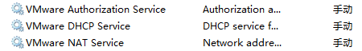
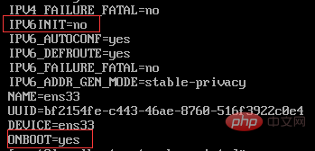
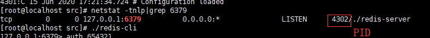

### SSH免密登录

设置完SSH免密登录之后可以不用输密码，因为服务器已经有本地电脑的公钥，只有本地私钥才能解密，所以不用密码登录也是安全的。

**ssh-keygen -t rsa生成的公私钥文件和known_hosts不能移动，因为SSH密码登录时要读取私钥文件，才能登录**

### 常用命令

#### ssh-keygen

~~~shell
ssh-keygen -t -rsa
~~~

### rz和sz

yum install -y lrzsz

不存在sz，rz命令的话，通过这个安装下yum install -y lrzsz


### sudo

sudo是一个程序，普通用户可以使用它以超级用户或其他用户的身份执行命令，sudo用户的访问权限是由 /etc/sudoers文件控制

###  端口占用(window)

netstat -aon|findstr 8080

结束进程

输入tasklist|findstr 2524命令，其中2524加英文双引号，按回车键就可以找到PID为2524的进程，如下图所示

### tail

tail  -fn100  catalina.log   查询日志尾部最后100行的日志,并且随文件;

### /usr/bin/xauth:  file /root/.Xauthority does not exist

#### 原因

添加用户时没有授权对应目录，仅仅执行了user add ,user没有授权对应目录

#### 解决办法

执行以下命令

### vmwarekey

FF31K-AHZD1-H8ETZ-8WWEZ-WUUVA
CV7T2-6WY5Q-48EWP-ZXY7X-QGUWD

### vmware

按照centos8报错 Section %packages dose not end with %end 

原因:vmware默认安装时到处两个CD/DVD,默认读取ios文件的路径没有设置对

### 连接不上网络

1 检查vmware的网络服务启动了没有



2 检查网卡是否启动

~~~shell
vi /etc/sysconfig/network-scripts/ifcfg-ens33
~~~

​	然后修改IPV6INIT=no，ONBOOT=yes

​		

### 网卡信息

~~~shell
ens33: flags=4163<UP,BROADCAST,RUNNING,MULTICAST>  mtu 1500
        从flags可知该接口已启用，支持广播、组播，mtu值
        inet 10.10.10.140  netmask 255.255.255.0  broadcast 10.10.10.255
        IPv4地址           子网掩码               广播地址
        inet6 fe80::20c:29ff:fec8:ff4e  prefixlen 64  scopeid 0x20<link>
        IPv6地址                        掩码长度      作用域，link表示仅该接口有效
        ether 00:0c:29:c8:ff:4e  txqueuelen 1000  (Ethernet)
        网卡接口的MAC地址        传输队列长度     接口类型为Ethernet
        RX packets 266  bytes 26083 (25.4 KiB)
        上行表示此接口接收的报文个数，总字节数
        RX errors 0  dropped 0  overruns 0  frame 0
        接收报文错误数，丢弃数，溢出数，冲突的帧数
        TX packets 141  bytes 20086 (19.6 KiB)
        上行表示此接口发送的报文个数，总字节数
        TX errors 0  dropped 0 overruns 0  carrier 0  collisions 0
        发送报文错误数，丢弃数，溢出数，载荷数，冲突数
~~~

ens33是网卡的名称

### 关闭防火墙

#### centos8/centos7

~~~shell
systemctl stop firewalld
~~~


### 命令

#### find

find和grep结合使用(管道)的例子

1 find find / |grep ".Xauthority"

2 find ~ |grep ".Xauthority"

3 find |grep sudo*

#### cp

cp  源文件路径  目标目录路径

例子

~~~shell
cp /soft/redis-5.0.5/sentinel.conf
cp /soft/redis-5.0.5/sentinel.conf  .  -- 最后面的表示当前目录
~~~

#### ps

ps命令是**Process Status**的缩写

```xml
命令参数：
a  显示所有进程
-a 显示同一终端下的所有程序
-A 显示所有进程
c  显示进程的真实名称
-N 反向选择
-e 等于“-A”
e  显示环境变量
f  显示程序间的关系
-H 显示树状结构
r  显示当前终端的进程
T  显示当前终端的所有程序
u  指定用户的所有进程
-au 显示较详细的资讯
-aux 显示所有包含其他使用者的行程 
-C<命令> 列出指定命令的状况
--lines<行数> 每页显示的行数
--width<字符数> 每页显示的字符数
--help 显示帮助信息
--version 显示版本显示
```

例子

~~~shell
ps -ef|grep redis
~~~

#### ls

~~~shell
ls -a
~~~

ls -a 可以查看隐藏的文件

#### cat


#### tail

语法

```shell
tail [参数] [文件] 
```

**参数：**

- -f 循环读取
- -q 不显示处理信息
- -v 显示详细的处理信息
- -c<数目> 显示的字节数
- -n<行数> 显示文件的尾部 n 行内容
- --pid=PID 与-f合用,表示在进程ID,PID死掉之后结束
- -q, --quiet, --silent 从不输出给出文件名的首部
- -s, --sleep-interval=S 与-f合用,表示在每次反复的间隔休眠S秒

例子

~~~shell
tail -f 1000 xxx.log
~~~

#### tar

-A, --catenate  　　　　　 追加 tar 文件至归档
-c, --create       　　　　 创建一个新归档
-r, --append       　　　　 追加文件至归档结尾
-u, --update       　　　  仅追加比归档中副本更新的文件
-x, --extract, --get   　　 　 从归档中解出文件
-t, --list         　　 　　列出归档内容
-z, --gzip, --gunzip, --ungzip  通过 gzip 压缩归档
-j, --bzip2         　　   通过 bzip2 压缩归档
-J, --xz          　　　　通过 xz 过滤归档
--lzip         　　　　　 通过 lzip 过滤归档
--lzma         　　　    通过 lzma 过滤归档
-Z, --compress, --uncompress  通过 compress 压缩归档
-v, --verbose        　   详细地列出处理的文件过程
-k, --keep-old-files  　　　保留源文件不覆盖
-m, --touch      　　      不要解压文件的修改时间
-W, --verify        　　　在写入以后尝试校验归档
f, --file=ARCHIVE     　 使用归档文件或 ARCHIVE 设备，这个参数是最后一个，后面只接文件名
-b, --blocking-factor=BLOCKS  设置每个记录 BLOCKS x 512 字节
-C, --directory=DIR    　 改变至目录 DIR
--help  　 　　　　　　  显示帮助信息
--version 　 　　　　　  显示版本信息

例子1

将 1.txt 2.txt 3.txt 4.txt 文件打包并压缩为 test.tar.gz

~~~shell
tar -zcvf test.tar.gz *.txt
~~~

例子2 

 将 test.tar.gz 解压

~~~shell
tar -zxvf test.tar.gz
~~~

#### touch

Linux touch命令用于修改文件或者目录的时间属性，包括存取时间和更改时间。若文件不存在，系统会建立一个新的文件。

ls -l 可以显示档案的时间记录

- **参数说明**：
- a 改变档案的读取时间记录。
- m 改变档案的修改时间记录。
- c 假如目的档案不存在，不会建立新的档案。与 --no-create 的效果一样。
- f 不使用，是为了与其他 unix 系统的相容性而保留。
- r 使用参考档的时间记录，与 --file 的效果一样。
- d 设定时间与日期，可以使用各种不同的格式。
- t 设定档案的时间记录，格式与 date 指令相同。
- --no-create 不会建立新档案。
- --help 列出指令格式。
- --version 列出版本讯息。

### 查看文件属性

ls -a 查看所有文件
  ls -l 查看详细的属性

2,lsattr
  查看文件的扩展属性,
  如果文件被　chattr +i  添加了写保护,
  用lsattr可以看到添加的属性

3,file
　查看文件的类型

4,stat
  查看文件的状态


### gcc

### 安装

1 yum install gcc

2 下载安装

  1http://mirrors.nju.edu.cn/gnu/gcc/

  2 http://mirrors.ustc.edu.cn/gnu/gcc/

 3 https://mirrors.tuna.tsinghua.edu.cn/gnu/gcc/

// 教程

https://cloud.tencent.com/developer/article/1424725

### 网卡设置

~~~she
TYPE=Ethernet    # 网卡类型：为以太网
PROXY_METHOD=none    # 代理方式：关闭状态
BROWSER_ONLY=no      # 只是浏览器：否
BOOTPROTO=dhcp  #设置网卡获得ip地址的方式，可能的选项为static(静态)，dhcp(dhcp协议)或bootp(bootp协议).
DEFROUTE=yes        # 默认路由：是, 不明白的可以百度关键词 `默认路由`
IPV4_FAILURE_FATAL=no     # 是不开启IPV4致命错误检测：否
IPV6INIT=yes         # IPV6是否自动初始化: 是[不会有任何影响, 现在还没用到IPV6]
IPV6_AUTOCONF=yes    # IPV6是否自动配置：是[不会有任何影响, 现在还没用到IPV6]
IPV6_DEFROUTE=yes     # IPV6是否可以为默认路由：是[不会有任何影响, 现在还没用到IPV6]
IPV6_FAILURE_FATAL=no     # 是不开启IPV6致命错误检测：否
IPV6_ADDR_GEN_MODE=stable-privacy   # IPV6地址生成模型：stable-privacy [这只一种生成IPV6的策略]
NAME=ens34     # 网卡物理设备名称  
UUID=8c75c2ba-d363-46d7-9a17-6719934267b7   # 通用唯一识别码，没事不要动它，否则你会后悔的。。
DEVICE=ens34   # 网卡设备名称, 必须和 `NAME` 值一样
ONBOOT=no #系统启动时是否设置此网络接口，设置为yes时，系统启动时激活此设备 
IPADDR=192.168.103.203   #网卡对应的ip地址
PREFIX=24             # 子网 24就是255.255.255.0
GATEWAY=192.168.103.1    #网关  
DNS1=114.114.114.114        # dns
HWADDR=78:2B:CB:57:28:E5  # mac地址
~~~

- 安装ifconfig

  ~~~properties
   yum install net-tools
  ~~~

#### ip命令常用参数

~~~shell
Ip  [选项]  操作对象{link|addr|route...}

# ip link show                           # 显示网络接口信息
# ip link set eth0 upi                   # 开启网卡
# ip link set eth0 down                  # 关闭网卡
# ip link set eth0 promisc on            # 开启网卡的混合模式
# ip link set eth0 promisc offi          # 关闭网卡的混个模式
# ip link set eth0 txqueuelen 1200       # 设置网卡队列长度
# ip link set eth0 mtu 1400              # 设置网卡最大传输单元
# ip addr show                           # 显示网卡IP信息
# ip addr add 192.168.0.1/24 dev eth0    # 设置eth0网卡IP地址192.168.0.1
# ip addr del 192.168.0.1/24 dev eth0    # 删除eth0网卡IP地址

# ip route list                                            # 查看路由信息
# ip route add 192.168.4.0/24  via  192.168.0.254 dev eth0 # 设置192.168.4.0网段的网关为192.168.0.254,数据走eth0接口
# ip route add default via  192.168.0.254  dev eth0        # 设置默认网关为192.168.0.254
# ip route del 192.168.4.0/24                              # 删除192.168.4.0网段的网关
# ip route del default                                     # 删除默认路由
~~~

### 网络配置

https://blog.csdn.net/chinaltx/article/details/86497165

### 查找指定端口

~~~shell
netstat -tnlp|grep 6379
~~~



~~~shell
lsof -i:6379
~~~

