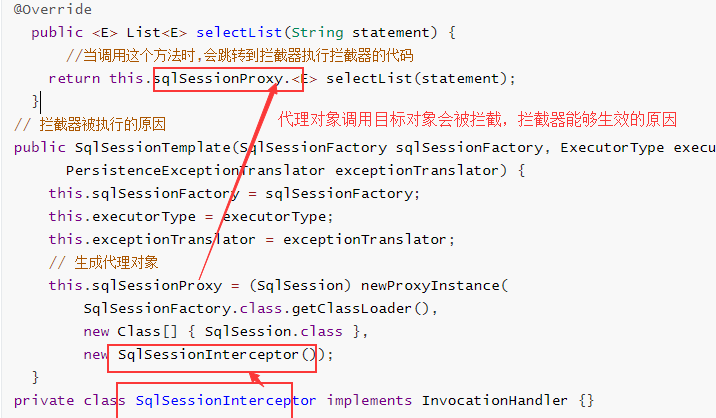

### 1 运行流程

~~~java
List<E> list = (List<E>) tcm.getObject(cache, key);
        if (list == null) {
          list = delegate.<E> query(ms, parameterObject, rowBounds, resultHandler, key, boundSql);
          tcm.putObject(cache, key, list); // issue #578 and #116
        }
        return list;
~~~

刚开始默认的执行起是CachingExecutor,原因看下面的代码 

org.apache.ibatis.session.Configuration

~~~java
public class Configuration{
    ...
    // 默认是cacheEnabled是true
    protected boolean cacheEnabled = true;
	...
public Executor newExecutor(Transaction transaction, ExecutorType executorType) {
    executorType = executorType == null ? defaultExecutorType : executorType;
    executorType = executorType == null ? ExecutorType.SIMPLE : executorType;
    Executor executor;
    if (ExecutorType.BATCH == executorType) {
      executor = new BatchExecutor(this, transaction);
    } else if (ExecutorType.REUSE == executorType) {
      executor = new ReuseExecutor(this, transaction);
    } else {
      executor = new SimpleExecutor(this, transaction);
    }
    // cacheEnabled默认值是true
    if (cacheEnabled) {
      executor = new CachingExecutor(executor);
    }
    executor = (Executor) interceptorChain.pluginAll(executor);
    return executor;
  }
    ...
}

~~~

CacheKey.update()

### 2 拦截流程

拦截代码实现原理的关键是

1 SqlSessionTemplate.selectList()

~~~java
@Override
  public <E> List<E> selectList(String statement) {
      //当调用这个方法时,会跳转到拦截器执行拦截器的代码
    return this.sqlSessionProxy.<E> selectList(statement);
  }
// 拦截器被执行的原因
public SqlSessionTemplate(SqlSessionFactory sqlSessionFactory, ExecutorType executorType,
      PersistenceExceptionTranslator exceptionTranslator) {
    this.sqlSessionFactory = sqlSessionFactory;
    this.executorType = executorType;
    this.exceptionTranslator = exceptionTranslator;
    // 生成代理对象
    this.sqlSessionProxy = (SqlSession) newProxyInstance(
        SqlSessionFactory.class.getClassLoader(),
        new Class[] { SqlSession.class },
        new SqlSessionInterceptor());
  }

private class SqlSessionInterceptor implements InvocationHandler {
    @Override
    public Object invoke(Object proxy, Method method, Object[] args) throws Throwable {
      SqlSession sqlSession = getSqlSession(
          SqlSessionTemplate.this.sqlSessionFactory,
          SqlSessionTemplate.this.executorType,
          SqlSessionTemplate.this.exceptionTranslator);
      try {
        Object result = method.invoke(sqlSession, args);
        if (!isSqlSessionTransactional(sqlSession, SqlSessionTemplate.this.sqlSessionFactory)) {
          // force commit even on non-dirty sessions because some databases require
          // a commit/rollback before calling close()
          sqlSession.commit(true);
        }
        return result;
      } catch (Throwable t) {
        Throwable unwrapped = unwrapThrowable(t);
        if (SqlSessionTemplate.this.exceptionTranslator != null && unwrapped instanceof PersistenceException) {
          // release the connection to avoid a deadlock if the translator is no loaded. See issue #22
          closeSqlSession(sqlSession, SqlSessionTemplate.this.sqlSessionFactory);
          sqlSession = null;
          Throwable translated = SqlSessionTemplate.this.exceptionTranslator.translateExceptionIfPossible((PersistenceException) unwrapped);
          if (translated != null) {
            unwrapped = translated;
          }
        }
        throw unwrapped;
      } finally {
        if (sqlSession != null) {
          closeSqlSession(sqlSession, SqlSessionTemplate.this.sqlSessionFactory);
        }
      }
    }
  }
~~~

