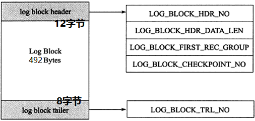
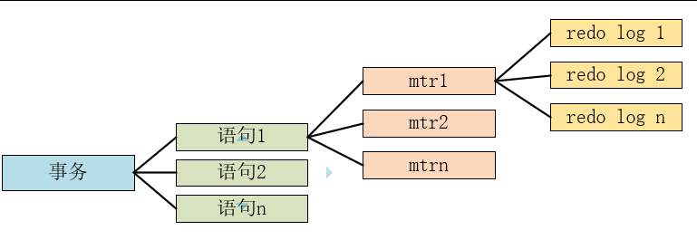
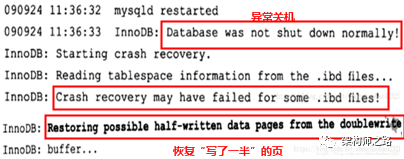
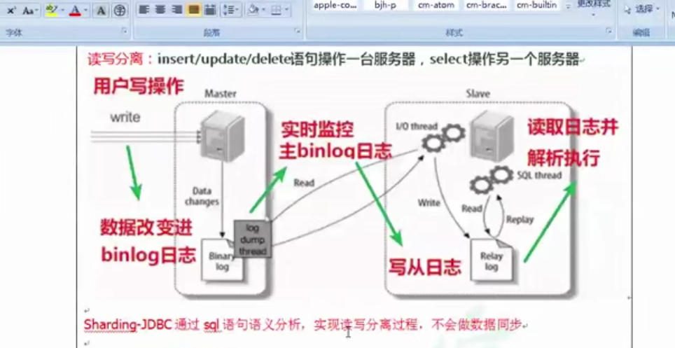

官网

https://www.mysql.com/cn/why-mysql/performance/

文档

https://dev.mysql.com/doc/refman/8.0/en/server-system-variable-reference.html

// 红黑树

https://blog.csdn.net/v_july_v/article/details/6105630

### 注意

**SQLyog这个工具，一个连接就只是一个事务，这点PLSQL Developer不一样，PLSQL Developer是新开一个SQL窗口就是一个新的事务，但是SQLyog在一个连接之内，多少个SQL执行窗口都是同一个事务**

## 1 sql语句

 **1.禁止使用count（常量）或者count（列名），因为它们避免不了NULL值    用count(\*)来计算条数**

2 禁用保留字，如 desc 、 **range** 、 match 、 delayed 等，请参考 MySQL 官方保留字

**like只有右边匹配才用索引,LIKE 'ptd_%'**

## 2 索引

https://www.cnblogs.com/nickchen121/p/11152523.html


**MySQL只能使用B-Tree索引做覆盖索引**

### 1 覆盖索引

**Extra中为Using index**

 MySQL 并不是跳过 offset 行，而是取 offset + N 行，然后返回放弃前 offset 行，返回
N 行，那当 offset 特别大的时候，效率就非常的低下，要么控制返回的总页数，要么对超过
特定阈值的页数进行 SQL 改写

例子:

SELECT a.* FROM 表 1 a, (select id from 表 1 where 条件 LIMIT 100000,20 ) b where a.id=b.id

##instr

INSTR(STR,SUBSTR) 

在一个**字符串(STR)**中搜索**指定的字符(SUBSTR)**,返回发现指定的字符的**位置(INDEX)**,**如果没有找到就直接返回0**


##正则表达式

| 元字符 | 描述                       |
| ------ | -------------------------- |
| _      | 表示单个字符               |
| ^      | 匹配字符串开始位置         |
| $      | 匹配字符串结束位置         |
| *      | 0个或者多个匹配            |
| +      | 个或者多个匹配（等于{1,}） |
| {n}    | 指定数目的匹配             |
| {n,}   | 不少于指定数目的匹配       |
| {n,m}  | 匹配数目的范围             |

##And 和OR执行顺序

**SQL语句碰到OR时，就会自动把条件分成2部分，等于两部分都加了括号！**

**如果where 后面有OR条件的话，则OR自动会把左右的查询条件分开**

例子1


## find_in_set

**注意 find_in_set 是全表扫描的**

####**语法：**FIND_IN_SET(str,strlist)

1. 假如**字符串**str*在由*N子链组成的**字符串列表**strlist*中，则返回值的范围在1到*N*之间

2. 一个字符串列表就是一个由一些被‘,’符号分开的自链组成的字符串
3. 如果第一个参数是一个常数字符串，而第二个是typeSET列，则FIND_IN_SET()函数被优化，使用**比特**计算
4. 如果*str*不在*strlist*或*strlist*为空字符串，则返回值为0
5. 如任意一个参数为NULL，则返回值为NULL。这个函数在第一个参数包含一个逗号(‘,’)时将无法正常运行

示例：**SELECT FIND_IN_SET('b','a,b,c,d');** //返回值为2，即第2个值

例子2:下面查询**btype字段中**包含**”15″这个参数的值**

```sql
SELECT * from test where FIND_IN_SET('15',btype)
```

##sql执行顺序

(1)from 

(2) on 

(3) join

(4) where 

(5)group by(开始使用select中的别名，后面的语句中都可以使用)

(6) avg,sum.... 

(7)having 

(8) select 

(9) distinct 

(10) order by 

##left join

**如果连接方式是inner join，在没有其他过滤条件的情况下MySQL会自动选择小表作为驱动表，但是left join在驱动表的选择上遵循的是左边驱动右边的原则，即left join左边的表名为驱动表**

##STRAIGHT_JOIN

**在STRAIGHT_JOIN左边的表名就是驱动表**

**驱动表的概念，mysql中指定了连接条件时，满足查询条件的记录行数少的表为驱动表；如未指定查询条件，则扫描行数少的为驱动表。mysql优化器就是这么粗暴以小表驱动大表的方式来决定执行顺序的**

## 慢查询

### 慢查询日志开启

在配置文件my.cnf或my.ini中在[mysqld]一行下面加入两个配置参数

log-slow-queries=/data/mysqldata/slow-query.log           

long_query_time=5

log-slow-queries参数为慢查询日志存放的位置，一般这个目录要有mysql的运行帐号的可写权限，一般都将这个目录设置为mysql的数据存放目录；

long_query_time=5中的**5表示查询超过五秒才记录**

还可以在my.cnf或者my.ini中添加log-queries-not-using-indexes参数，表示记录下没有使用索引的查询

## order by

要尽可能的保证排序字段在驱动表中

排序要避免Using filesort，Using temporary

如果排序查询的数据两大于这个默认值的话，还是会使用Using filesort，order by 出现using filesort的常规解决办法是建索引，或者组合索引


## explain

https://www.jianshu.com/p/73f2c8448722

https://www.cnblogs.com/galengao/p/5780958.html

http://www.cnitblog.com/aliyiyi08/archive/2008/09/09/48878.html

https://www.cnblogs.com/xiaoqiang-code/p/11404149.html

https://blog.csdn.net/kk185800961/article/details/49179619

### id

id相同，从上往下执行，id不同，如果是子查询，则序号会递增，id值越大优先级越高，越先被执行

- **id 为 null**： 最后执行

- 如果id相同，则认为是一组，从上往下顺序执行；**在所有组中，id值越大，优先级越高，越先执行**

### rows

rows：MYSQL认为必须检查的用来返回请求数据的行数

**这里是执行计划中估算的扫描行数，不是精确值**

### key

实际使用的索引，如果为空表示没有使用索引

### key_len

使用索引的长度，在不损失精确度的情况下，长度越短越好

### type

这是重要的列，显示连接的类型，从最好到最差是 **ALL, index,  range, ref, eq_ref, const, system, NULL**

#### const

```mysql
表最多只有一个匹配行，在查询开始时被读取。因为只有一个值，优化器将该列值视为常量。当在`*`primarykey`*`或者`*`unique`*`索引作为常量比较时被使用
```


产生“ Impossible WHERE noticed after reading const tables”的原因是这样的，当在查询语句中存在满足如下条件的 WHERE 语句时，MySQL在 EXPLAIN 之前会优先根据这一条件查找出对应的记录，并用记录的实际值替换查询中所有使用到的该表属性。这是因为满足以下四个条件时，就会使得针对该表的查询最多只能产生一条命中结果。**在该表无法命中数据的情况下就会提示“在 const table 表中没有找到匹配的行”**，而这个 “const table”就指的是满足下面四个条件的表。这是 MySQL 的一个优化策略。

当查询条件中包含了某个表的主键或者非空的唯一索引列
该列的判定条件为等值条件
目标值的类型与该列的类型一致
目标值为一个确定的常量

#### eq_ref

唯一性索引扫描，对于每个索引建，表中只有一条记录与之匹配，常见于主键或者唯一性扫描

#### ref

非唯一性索引扫描，返回匹配某个单独值的所有行，本质上也是一种索引访问，它返回所有匹配某个单独值的行，然而它可能会找到多个符合条件的行

~~~sql
explain select * from tabname where tid=2
~~~


####  ref_or_null

~~~sql
explain select id,tid from tabname where tid=2 or tid is null
~~~


#### fulltext

~~~sql
// 创建全文索引
ALTER TABLE tabname2 ADD FULLTEXT(NAME)
EXPLAIN SELECT * FROM tabname2 WHERE MATCH(NAME) AGAINST('love');
~~~


#### range

只检索给定范围的行，使用一个索引来选择行，key列显示使用了哪个索引

~~~sql
EXPLAIN SELECT * FROM tabname WHERE id>1
/*在主键列使用in查询type类型就是range*/
explain select * from tabname where id in(1,2,3)
~~~

​	

#### index

Full Index Scan ,index和All区别为index类型只遍历索引树

**索引全表扫描，把索引从头到尾扫一遍，常见于使用索引列就可以处理不需要读取数据文件的查询、可以使用索引排序或者分组的查询**

~~~sql
EXPLAIN SELECT tid FROM tabname
~~~


**索引全表扫描，把索引从头到尾扫一遍，常见于使用索引列就可以处理不需要读取数据文件的查询、可以使用索引排序或者分组的查询**

#### All

Full Table Scan，全表扫描

### select_type

~~~sql
// 建表语句
create table tabname (
id int auto_increment not null primary key,
name varchar(10) null,
indate datetime null,
tid int null,
key(tid),
key(indate)
)engine=innodb;


create table tabname2 (
id int auto_increment not null primary key,
name varchar(10) null,
indate datetime null,
tid int null,
key(tid),
key(indate)
)
~~~


1 simple 2 primary 3 subquery 4 derived  5 union 6 union result

#### 1 simple

简单select 查询，不包含子查询或union

#### 2 primary

查询不包含任何复杂的子部分，最外层被标记为primary

#### 3 subquery

在select或where中包含子查询

primary：复杂查询中最外层的select
subquery：包含在select中的子查询（不在from子句中）
derived：包含在from子句中的子查询。MySQL会将结果存放在一个临时表中，也称为派生表

~~~sql
explain select (select 1 from actor where id = 1) from (select * from film
where id = 1) der;
~~~


#### 4 derived

**from子句的查询 例如select  * from (select * from a ) b**

在from列表中包含子查询被标记为derived(衍生)，mysql会递归执行子查询，把结果放在临时表

DERIVED：用于 from 子句里有子查询的情况。MySQL 会递归执行这些子查询，把结果放在临时表里

#### 5 union

若第二个select出现在union之后，则被标记为union,若union包含在from子句的子查询中，外层select将被标记为derived

例如下图，id为null, union result 就是对两个查询结果排序去重，id为null是最后执行，即在两个结果查询完之后对结果集合并去重


下图是没有union result的情况


#### 6 union result

UNION RESULT：UNION 的结果

#### 7 Materialization

MySQL引入了Materialization（物化）这一关键特性用于子查询（比如在IN/NOT IN子查询以及 FROM 子查询）优化。 具体实现方式是：在SQL执行过程中，第一次需要子查询结果时执行子查询并将子查询的结果保存为临时表 ，后续对子查询结果集的访问将直接通过临时表获得。 与此同时，优化器还具有延迟物化子查询的能力，先通过其它条件判断子查询是否真的需要执行。物化子查询优化SQL执行的关键点在于对子查询只需要执行一次。 与之相对的执行方式是对外表的每一行都对子查询进行调用，其执行计划中的查询类型为“DEPENDENT SUBQUERY”

#### 8 DEPENDENT SUBQUERY

~~~sql
explain select *,(select name from tabname b where a.id=b.id) from tabname a;
~~~


#### 9 PRIMARY / DEPENDENT UNION / DEPENDENT SUBQUERY / UNION RESULT

~~~sql
EXPLAIN SELECT * FROM tabname c WHERE c.id IN (SELECT id FROM tabname a UNION SELECT id FROM tabname b );
~~~


### 索引

索引文件具有**B-tree**的最左前缀匹配特性，如果左边的值未确定，那么无法使用此索引

复合索引生效遵循最左匹配原则，index(a,b,c)，

1 a

 2 a,b,c

3 a,b

4 a,c  **这四种情况都生效**


5 b,c

6 c

7 b  **都不生效**

### ref

上述表的连接匹配条件，即哪些列或常量被用于查找索引列的值

### extra

#### using temporary

第一种(子查询,适合子查询部分不作为查询条件)

子查询暂时有两种 1 在from子句中使用子查询 2 where子句中用exists子查询

暂时不知left join 是否导致using temporary

第二种 非直接关联变直接关联，慎用left join


A：distinct：在select部分使用了distinc关键字
 B：no tables used：不带from字句的查询或者From dual查询
 C：使用not in()形式子查询或not exists运算符的连接查询，这种叫做反连接。即，一般连接查询是先查询内表，再查询外表，反连接就是先查询外表，再查询内表。
 D：using filesort：排序时无法使用到索引时，就会出现这个。常见于order by和group by语句中
 E：using index：查询时不需要回表查询，直接通过索引就可以获取查询的数据。
 F：using join buffer（block nested loop），using join buffer（batched key accss）：5.6.x之后的版本优化关联查询的BNL，BKA特性。主要是减少内表的循环数量以及比较顺序地扫描查询。
 G：using sort_union，using_union，using intersect，using sort_intersection：
 using intersect：表示使用and的各个索引的条件时，该信息表示是从处理结果获取交集
 using union：表示使用or连接各个使用索引的条件时，该信息表示从处理结果获取并集
 using sort_union和using sort_intersection：与前面两个对应的类似，只是他们是出现在用and和or查询信息量大时，先查询主键，然后进行排序合并后，才能读取记录并返回。
 H：using temporary：表示使用了临时表存储中间结果。临时表可以是内存临时表和磁盘临时表，执行计划中看不出来，需要查看status变量，used_tmp_table，used_tmp_disk_table才能看出来。
 I：using where：表示存储引擎返回的记录并不是所有的都满足查询条件，需要在server层进行过滤。查询条件中分为限制条件和检查条件，5.6之前，存储引擎只能根据限制条件扫描数据并返回，然后server层根据检查条件进行过滤再返回真正符合查询的数据。5.6.x之后支持ICP特性，可以把检查条件也下推到存储引擎层，不符合检查条件和限制条件的数据，直接不读取，这样就大大减少了存储引擎扫描的记录数量。extra列显示using index condition
 J：firstmatch(tb_name)：5.6.x开始引入的优化子查询的新特性之一，常见于where字句含有in()类型的子查询。如果内表的数据量比较大，就可能出现这个
 K：loosescan(m..n)：5.6.x之后引入的优化子查询的新特性之一，在in()类型的子查询中，子查询返回的可能有重复记录时，就可能出现这个

### filtered

使用explain extended时会出现这个列，5.7之后的版本默认就有这个字段，不需要使用explain extended了。这个字段表示存储引擎返回的数据在server层过滤后，剩下多少满足查询的记录数量的比例，注意是百分比，不是具体记录数

### profile

SHOW VARIABLES LIKE '%profiling%';

profiling off表示profile关闭，profiling_history_size 15表示保存最近15条SQL的资源消耗情况

开启profile功能，可以使用命令

```sql
set global profiling = 1;
```

然后就可以使用下面命令

```sql
show profiles;
```

#### 使用案例


显示一条SQL的具体花销在哪里


#### Sending data

是包括**收集 + 发送 数据**。
这里的关键是为什么要收集数据，原因在于：mysql使用**索引**完成查询结束后，mysql得到了一堆的**行id**，如果有的列并不在索引中，mysql需要重新到**数据行**上将需要返回的数据读取出来返回个客户端。


### possible_keys

这一列显示查询**可能**使用哪些索引来查找

**将 mod(id, '16')= '5' 函数转换条件放在子查询外层**


## date_format

```mysql
DATE_FORMAT(date,format)
```

| 格式 | 描述                                           |
| ---- | ---------------------------------------------- |
| %a   | 缩写星期名                                     |
| %b   | 缩写月名                                       |
| %c   | 月，数值                                       |
| %D   | 带有英文前缀的月中的天                         |
| %d   | 月的天，数值(00-31)                            |
| %e   | 月的天，数值(0-31)                             |
| %f   | 微秒                                           |
| %H   | 小时 (00-23)                                   |
| %h   | 小时 (01-12)                                   |
| %I   | 小时 (01-12)                                   |
| %i   | 分钟，数值(00-59)                              |
| %j   | 年的天 (001-366)                               |
| %k   | 小时 (0-23)                                    |
| %l   | 小时 (1-12)                                    |
| %M   | 月名                                           |
| %m   | 月，数值(00-12)                                |
| %p   | AM 或 PM                                       |
| %r   | 时间，12-小时（hh:mm:ss AM 或 PM）             |
| %S   | 秒(00-59)                                      |
| %s   | 秒(00-59)                                      |
| %T   | 时间, 24-小时 (hh:mm:ss)                       |
| %U   | 周 (00-53) 星期日是一周的第一天                |
| %u   | 周 (00-53) 星期一是一周的第一天                |
| %V   | 周 (01-53) 星期日是一周的第一天，与 %X 使用    |
| %v   | 周 (01-53) 星期一是一周的第一天，与 %x 使用    |
| %W   | 星期名                                         |
| %w   | 周的天 （0=星期日, 6=星期六）                  |
| %X   | 年，其中的星期日是周的第一天，4 位，与 %V 使用 |
| %x   | 年，其中的星期一是周的第一天，4 位，与 %v 使用 |
| %Y   | 年，4 位                                       |
| %y   | 年，2 位                                       |

常用:

date_format(date,'%Y-%m-%d %H:%i:%s')

## TIMESTAMPDIFF

TIMESTAMPDIFF(unit,datetime_expr1,datetime_expr2)

unit值如下:

FRAC_SECOND (microseconds), SECOND, MINUTE, HOUR, DAY, WEEK, MONTH, QUARTER, YEAR

### 例子

\#计算两日期之间相差多少周

select timestampdiff(week,'2011-09-30','2015-05-04');

\#计算两日期之间相差多少天

select timestampdiff(day,'2011-09-30','2015-05-04');

### FROM_UNIXTIME

语法:FROM_UNIXTIME(unix_timestamp,format)

例子

FROM_UNIXTIME(create_time/1000,'%Y-%m-%d %H:%i:%S')

sql

### mysql varchar

```sql
首先要确定mysql版本
4.0版本以下，varchar(50)，指的是50字节，如果存放UTF8汉字时，只能存16个（每个汉字3字节） 
5.0版本以上，varchar(50)，指的是50字符，无论存放的是数字、字母还是UTF8汉字（每个汉字3字节），都可以存放50个
```

### show processlist

processlist命令的输出结果**显示了有哪些线程在运行**，不仅可以查看当前所有的连接数，还可以查看当前的连接状态帮助识别出有问题的查询语句等。

如果是root帐号，能看到所有用户的当前连接。如果是其他普通帐号，则只能看到自己占用的连接。showprocesslist只能列出当前100条。如果想全部列出，可以使用**SHOW FULL PROCESSLIST**命令

### 索引原则

1 =和in可以乱序，比如a = 1 and b = 2 and c = 3 建立**(a,b,c)索引**可以任意顺序，mysql的查询优化器会帮你优化成索引可以识别的形式。

2.索引列不能参与计算，保持列“干净”，比如from_unixtime(create_time) = ’2014-05-29’就不能使用到索引，原因很简单，b+树中存的都是数据表中的字段值，但进行检索时，需要把所有元素都应用函数才能比较，显然成本太大。所以语句应该写成create_time = unix_timestamp(’2014-05-29’)

3 建索引的列的值要区分度要高，例如某列只有-1,0,1三个值，加上索引也不能锁定少量数据

第一：不要指望所有语句都能通过SQL优化，第二：不要过于自信，只针对具体case来优化，而忽略了更复杂的情况

### 索引

#### B+树性质

1. **索引字段要尽量的小：**通过上面的分析，我们知道IO次数取决于b+数的高度h，假设当前数据表的数据为N，每个磁盘块的数据项的数量是m，则有h=㏒(m+1)N，当数据量N一定的情况下，m越大，h越小；而m = 磁盘块的大小(4K) / 数据项的大小，磁盘块的大小也就是一个数据页的大小，是固定的，如果数据项占的空间越小，数据项的数量越多，树的高度越低。这就是为什么每个数据项，即索引字段要尽量的小，比如int占4字节，要比bigint8字节少一半。这也是为什么b+树要求把真实的数据放到叶子节点而不是内层节点，一旦放到内层节点，磁盘块的数据项会大幅度下降，导致树增高。当数据项等于1时将会退化成线性表。
2. **索引的最左匹配特性：**当b+树的数据项是复合的数据结构，比如(name,age,sex)的时候，b+数是按照从左到右的顺序来建立搜索树的，比如当(张三,20,F)这样的数据来检索的时候，b+树会优先比较name来确定下一步的所搜方向，如果name相同再依次比较age和sex，最后得到检索的数据；但当(20,F)这样的没有name的数据来的时候，b+树就不知道下一步该查哪个节点，因为建立搜索树的时候name就是第一个比较因子，必须要先根据name来搜索才能知道下一步去哪里查询。比如当(张三,F)这样的数据来检索时，b+树可以用name来指定搜索方向，但下一个字段age的缺失，所以只能把名字等于张三的数据都找到，然后再匹配性别是F的数据了， 这个是非常重要的性质，即索引的最左匹配特性

#### 聚集索引

InnoDB存储引擎表是索引组织表，即表中数据按照主键顺序存放。
而聚集索引（clustered index）就是按照每张表的主键构造一棵B+树，同时叶子结点存放的即为整张表的行记录数据，也将聚集索引的叶子结点称为数据页。
聚集索引的这个特性决定了索引组织表中数据也是索引的一部分。同B+树数据结构一样，每个数据页都通过一个双向链表来进行链接。

如果未定义主键，MySQL取第一个唯一索引（unique）而且只含非空列（NOT NULL）作为主键，InnoDB使用它作为聚簇索引。

如果没有这样的列，InnoDB就自己产生一个这样的ID值，它有六个字节，而且是隐藏的，使其作为聚簇索引。

由于实际的数据页只能按照一棵B+树进行排序，因此每张表只能拥有一个聚集索引。
在多数情况下，查询优化器倾向于采用聚集索引。因为聚集索引能够在B+树索引的叶子节点上直接找到数据。
此外由于定义了数据的逻辑顺序，聚集索引能够特别快地访问针对范围值得查询


#### 非聚集索引

表中除了聚集索引外其他索引都是辅助索引（Secondary Index，也称为非聚集索引），与聚集索引的区别是：辅助索引的叶子节点不包含行记录的全部数据。

叶子节点除了包含键值以外，每个叶子节点中的索引行中还包含一个书签（bookmark）。该书签用来告诉InnoDB存储引擎去哪里可以找到与索引相对应的行数据


辅助索引的存在并不影响数据在聚集索引中的组织，因此每张表上可以有多个辅助索引，但只能有一个聚集索引。当通过辅助索引来寻找数据时，**InnoDB存储引擎会遍历辅助索引并通过叶子级别的指针**获得只想**主键索引的主键**，然后再通过**主键索引**来找到一个**完整的行记录**


举例来说，如果在一棵高度为3的辅助索引树种查找数据，那需要对这个辅助索引树遍历3次找到指定主键，如果聚集索引树的高度同样为3，那么还需要对聚集索引树进行3次查找，最终找到一个完整的行数据所在的页，因此一共需要6次逻辑IO访问才能得到最终的一个数据页


#### B+Tree


#### hash索引和B+Tree索引

1 区别:hash索引没有办法利用索引完成排序,hash索引不支持多列联合索引的最左匹配规则，如果有大量重复键值,hash的性能比较低

2 hash索引是基于key-value的存储结构，B+Tree是一种多路平衡查询树

3 字符串用in不走索引

  例子:user_account in ('','')

4 or分割的条件，如果or前的条件中的列有索引，二后面的列没有索引，那么涉及的索引都不会用到

在倒入数据前限制性set unique_checks=0，关闭唯一性校验，再倒入结束后执行set unique_checks=1，恢复唯一性校验可以提高到付效率。

### innoDB

1 InnoDB支持事,MyISAM不支持事务

2 InnoDB支持行级锁

#### 特性

1 插入缓冲(insert buffer)

2 二次写(double write)

~~~sql
show global status like 'innodb_dblwr%'
~~~

说明：用户若需要统计数据库在生产环境中写入的量，可以通过innodb_dblwr_pages_written进行统计。

参数skip_innodb_doublewrite可以禁止使用doublewrite功能

3 自适应哈希索引

4 预读(read ahead)

### mysql id自增

https://www.csdn.net/gather_20/MtTaIgzsMTAwMC1ibG9n.html

http://ju.outofmemory.cn/entry/370625

InnoDB会为自增的列维护一个计数器，这个计数器的值维护在内存中，而不是数据文件中

#### 数据库重启后恢复自增值

InnoDB 引擎的自增值，其实是保存在了内存里，并且到了 MySQL 8.0 版本后，才有了“自增值持久化”的能力，也就是才实现了“如果发生重启，表的自增值可以恢复为 MySQL 重启前的值”，具体情况是：
在 MySQL 5.7 及之前的版本，自增值保存在内存里，并没有持久化。每次重启后，第一次打开表的时候，都会去找自增值的最大值 max(id)，然后将 max(id)+1 作为这个表当前的自增值。
举例来说，如果一个表当前数据行里最大的 id 是 10，AUTO_INCREMENT=11。这时候，我们删除 id=10 的行，AUTO_INCREMENT 还是 11。但如果马上重启实例，重启后这个表的 AUTO_INCREMENT 就会变成 10。
也就是说，MySQL 重启可能会修改一个表的 AUTO_INCREMENT 的值。
在 MySQL 8.0 版本，将自增值的变更记录在了 redo log 中，重启的时候依靠 redo log 恢复重启之前的值

MyISAM存入数据文件中


### 事务的实现原理

1、实现事务特性的原理：
使用Redo Log和Undo Log，Undo Log用于帮助未提交事务进行回滚，Redo Log记录
已经提交的事务，Undo Log会随机读写，而Redo Log基本是顺序

### join

1 left join A表为驱动表

2 inner join MySQL会自动找出数据少的表作为驱动表

3 right join B 表作为驱动表

4 straight_join强制指定左边的表就是驱动表


### 事务

#### show variables

**SHOW VARIABLES **

show variables like '变量名称'

#### 变量

MySQL维护两种变量，一种是全局变量，一种是局部变量，全局变量的值的修改是set global var_name ,

查看全局变量语句

show  [global | session ] variables like 

**修改全局变量需要super权限**

局部变量是 set  session var_name

#### show  status

show status LIKE  '状态名称'

使用show status查看MySQL服务器状态信息


#### 1 隔离级别设置

~~~ sql
//查看数据库版本
mysql> select @@version;    
+-----------+
| @@version |
+-----------+
| 8.0.12    |
+-----------+
1 row in set (0.01 sec)
1.查看当前会话隔离级别
select @@tx_isolation;
2.查看系统当前隔离级别
select @@global.tx_isolation;
3.设置当前会话隔离级别
set session transaction isolation level repeatable read;
4.设置系统当前隔离级别
set global transaction isolation level repeatable read;

//查看数据库隔离级别
//这条sql才能看到事务的隔离级别 SHOW VARIABLES LIKE 'tx_isolation%'
mysql> select @@transaction_isolation;
+-------------------------+
| @@transaction_isolation |
+-------------------------+
| REPEATABLE-READ         |
+-------------------------+
1 row in set (0.02 sec)


//查看数据库是否是自动提交
mysql> show variables like 'autocommit';
+---------------+-------+
| Variable_name | Value |
+---------------+-------+
| autocommit    | ON    |
+---------------+-------+
1 row in set (0.03 sec)


//将数据库 自动提交 去掉
//永久生效设置方法：
//通过修改配置文件my.cnf文件，通过vim编辑my.cnf文件，在[mysqld]（服务器选项下）添加:
//autocommit=0
mysql> set autocommit = 0;
Query OK, 0 rows affected (0.00 sec)


//再次查看事务是否自动提交
mysql> show variables like 'autocommit';
+---------------+-------+
| Variable_name | Value |
+---------------+-------+
| autocommit    | OFF   |
+---------------+-------+
1 row in set (0.04 sec)


现在来看看MySQL数据库为我们提供的四种隔离级别：

　　1.Serializable (串行化)：可避免脏读、不可重复读、幻读的发生。

　　2. Repeatable read (可重复读)：可避免脏读、不可重复读的发生。

　　3. Read committed (读已提交)：可避免脏读的发生。

　　4. Read uncommitted (读未提交)：最低级别，任何情况都无法保证。


//设置数据库的隔离级别
mysql> set transaction isolation level read committed;
Query OK, 0 rows affected (0.00 sec)


//开始事务
mysql> start transaction;
Query OK, 0 rows affected (0.00 sec)


//设置数据库的隔离级别
set session transaction isolation level read committed;
set session transaction isolation level read uncommitted;
set session transaction isolation level repeatable read;
set session transaction isolation level serializable;
~~~

#### 2 设置session隔离级别


#### 四种隔离级别

http://www.zsythink.net/archives/1233

https://blog.csdn.net/weishuai528/article/details/90676316

##### 1 read uncommit（读未提交）

当前事务可以看到其他事务未提交的数据，这种现象就是脏读，例如事务1修改了数据，但是**未提交事务**,事务2可以看到事务1修改未提交的数据就是脏读

#### 2  read commit (读已提交)

读已提交就是当前事务只能读取另外一个事务修改并提交是数据，未提交的数据读取不到

可重复读存在的问题就是不可重复读

##### 不可重复读

不可重复读：就是在同一个事务中一条SQL执行两次得到的结果不一致

例子

事务1 

1 设置隔离级别是read committed

2 设置不自动提交

3 使用begin开启事务，并读取表t1的数据


事务2

1 设置隔离级别是read committed

2 设置不自动提交

3 使用begin开启事务，并读取表t1的数据


4 修改数据，并提交


事务1

t1表更新前


更新后

​          


以上的例子就是**同一个事务*同一SQL*在不同的时间**查询得到的**结果不一致**，就是**不可重复读**

，解决办法就是将隔离级别设置成可重复读(repeatable read)

#### 3 repeatable read(可重复读)

可重复读存在幻读的问题

可重复读就是开启事务1，然后读取数据，然后再开启事务2，然后更新数据提交之后，事务1再执行SQL查询到的结果和第一次查询得到的结果是一样的

例子，如下图


##### 幻读

https://segmentfault.com/a/1190000016566788?utm_source=tag-newest

幻读主要是针对新增和删除的，就是在同一个事务中，执行更新时会多出几条数据


#### 读写锁并行问题

事务的隔离是由锁实现的，在执行update、insert、delete操作时，会加上写锁，但是其他事务仍然可以读取被加锁的数据，这是因为InnoDB采用了"一致性非锁定读"的机制来提高并发性，即在需要被读取的数据行被加排它锁之后，不会等待排它锁的释放，而是读取一个快照的数据，如下图


#### 4 串行化

串行化就是写和读操作不能并行执行


### SQL提示

常用的SQL提示(SQL HiNT)

USE INDEX:使用USE INDEX是希望MySQL去参考索引列表，就可以让MySQL不需要考虑其他可用索引，其实也就是possible_keys属性下参考的索引值

~~~sql
select* from user_info use index(id_index,ind_name_id) where user_id>0;
~~~

FORCE INDEX:强制索引，比如where user_id > 0，但是user_id在表中都是大于0的，自然就会进行ALL全表搜索，但是使用FORCE INDEX虽然执行效率不是最高（where user_id > 0条件决定的）但MySQL还是使用索引。

~~~sql
mysql> explain select* from user_info where user_id>0;
+----+-------------+-----------+------------+------+----------------------+------+---------+------+------+----------+-------------+
| id | select_type | table     | partitions | type | possible_keys        | key  | key_len | ref  | rows | filtered | Extra       |
+----+-------------+-----------+------------+------+----------------------+------+---------+------+------+----------+-------------+
|  1 | SIMPLE      | user_info | NULL       | ALL  | ind_name_id,id_index | NULL | NULL    | NULL |    4 |      100 | Using where |
+----+-------------+-----------+------------+------+----------------------+------+---------+------+------+----------+-------------+
1 row in set
~~~

之后强制使用独立索引id_index(user_id)：

~~~sql
mysql> explain select* from user_info force index(id_index) where user_id>0;
+----+-------------+-----------+------------+-------+---------------+----------+---------+------+------+----------+-----------------------+
| id | select_type | table     | partitions | type  | possible_keys | key      | key_len | ref  | rows | filtered | Extra                 |
+----+-------------+-----------+------------+-------+---------------+----------+---------+------+------+----------+-----------------------+
|  1 | SIMPLE      | user_info | NULL       | range | id_index      | id_index | 4       | NULL |    4 |      100 | Using index condition |
+----+-------------+-----------+------------+-------+---------------+----------+---------+------+------+----------+-----------------------+
1 row in set
~~~

### group by 

MySQL中的GROUP BY语句会对其后出现的字段进行默认排序,**使用ORDER BY NULL禁止排序**

### 大批量插入数据优化

（1）对于MyISAM存储引擎的表，可以使用：DISABLE KEYS 和 ENABLE KEYS 用来打开或者关闭 MyISAM 表非唯一索引的更新。

~~~sql
ALTER TABLE tbl_name DISABLE KEYS;
loading the data
ALTER TABLE tbl_name ENABLE KEYS;
~~~

② 导入数据前执行SET UNIQUE_CHECKS=0，关闭唯一性校验，带导入之后再打开设置为1：校验会消耗时间，在数据量大的情况下需要考虑。

③ 导入前设置SET AUTOCOMMIT=0，关闭自动提交，导入后结束再设置为1：这是因为自动提交会消耗部分时间与资源，虽然消耗不是很大，但是在数据量大的情况下还是得考虑


### 查看存储引擎

~~~Sql
// 查看mysql提供什么引擎
SHOW ENGINES
// 查看当前的存储引擎
SHOW VARIABLES LIKE '%storage_engine%'
// 查看某个表的存储引擎
SHOW CREATE TABLE notification
2、设置InnoDB为默认引擎：
在配置文件my.cnf中的 [mysqld] 下面加入
default-storage-engine=INNODB 
~~~

### MySQL临时表

MySQL临时表分为外部临时表和内部临时表

外部临时表对当前会话的当前用户可见

内部临时表对用户不可见

MySQL内部临时表是一种特殊轻量级的临时表，用来进行性能优化。

内部临时表有两种类型：一种是HEAP临时表，这种临时表的所有数据都会存在内存中，对于这种表的操作不需要IO操作。另一种是OnDisk临时表，顾名思义，这种临时表会将数据存储在磁盘上。OnDisk临时表用来处理中间结果比较大的操作。如果HEAP临时表存储的数据大于MAX_HEAP_TABLE_SIZE（详情请参考MySQL手册中系统变量部分），HEAP临时表将会被自动转换成OnDisk临时表。OnDisk临时表在5.7中可以通过INTERNAL_TMP_DISK_STORAGE_ENGINE系统变量选择使用MyISAM引擎或者InnoDB引擎

~~~sql
SHOW VARIABLES LIKE  '%MAX_HEAP_TABLE_SIZE%';
~~~


### 日志

MySQL日志管理 ========================================================

 错误日志: 记录 MySQL 服务器启动、关闭及运行错误等信息

 二进制日志: 又称binlog日志，以二进制文件的方式记录数据库中除 SELECT 以外的操作 

查询日志: 记录查询的信息 慢查询日志: 记录执行时间超过指定时间的操作 

中继日志： 备库将主库的二进制日志复制到自己的中继日志中，从而在本地进行重放 

通用日志： 审计哪个账号、在哪个时段、做了哪些事件 

事务日志或称redo日志： 记录Innodb事务相关的如事务执行时间、检查点等


#### binglog

~~~sql
// 查看binlog日志位置
show binlog events
//获取binlog文件列表
show binary logs

2、用mysqlbinlog工具查看
基于开始/结束时间
[root@hd3 ~]# mysqlbinlog --start-datetime='2016-08-02 00:00:00' --stop-datetime='2016-08-03 23:01:01' -d hadoop /var/lib/mysql/mysql-bin.000001
//如果需要查询2017-09-17 07:21:09到2017-09-19 07:59:50 数据库为geeRunner 的操作日志，输入如下命令将数据写入到一个备用的txt即可
mysqlbinlog --no-defaults --database=geeRunner --start-datetime="2017-09-17 07:21:09" --stop-datetime="2017-09-19 07:59:50" binlogs.000080 > sanjiaomao.txt
//如果需要过滤，只查询insert，update，delete的语句，可以这样写
mysqlbinlog --no-defaults --database=raceEnroll  binlogs.000078 |grep update |more
~~~

#### redo log

https://cloud.tencent.com/developer/article/1533847

https://www.cnblogs.com/f-ck-need-u/archive/2018/05/08/9010872.html

Redo log的存储都是以 **块(block)** 为单位进行存储的，每个块的大小为512字节。同磁盘扇区大小一致，可以保证块的写入是原子操作。

redo log以块为单位进行存储的，每个块占512字节，这称为redo log block

每个redo log block由3部分组成：**日志块头、日志块尾和日志主体**。

日志块头包含4部分：

- Ÿ log_block_hdr_no：(4字节)该日志块在redo log buffer中的位置ID。
- Ÿ log_block_hdr_data_len：(2字节)该log block中已记录的log大小。写满该log block时为0x200，表示512字节。
- Ÿ log_block_first_rec_group：(2字节)该log block中第一个log的开始偏移位置。
- Ÿ lock_block_checkpoint_no：(4字节)写入检查点信息的位置。



关于log block块头的第三部分 log_block_first_rec_group ，因为有时候一个数据页产生的日志量超出了一个日志块，这是需要用多个日志块来记录该页的相关日志。例如，某一数据页产生了552字节的日志量，那么需要占用两个日志块，第一个日志块占用492字节，第二个日志块需要占用60个字节，那么对于第二个日志块来说，它的第一个log的开始位置就是73字节(60+12)。如果该部分的值和 log_block_hdr_data_len 相等，则说明该log block中没有新开始的日志块，即表示该日志块用来延续前一个日志块。

日志尾只有一个部分： log_block_trl_no ，该值和块头的 log_block_hdr_no 相等

其中log block中492字节的部分是log body，该log body的格式分为4部分

- redo_log_type：占用1个字节，表示redo log的日志类型。
- space：表示表空间的ID，采用压缩的方式后，占用的空间可能小于4字节。
- page_no：表示页的偏移量，同样是压缩过的。
- Ÿredo_log_body表示每个重做日志的数据部分，恢复时会调用相应的函数进行解析。例如insert语句和delete语句写入redo log的内容是不一样的

#####  日志刷盘规则

刷日志到磁盘有以下几种规则：

**1.发出commit动作时。已经说明过，commit发出后是否刷日志由变量 innodb_flush_log_at_trx_commit 控制。**

**2.每秒刷一次。这个刷日志的频率由变量 innodb_flush_log_at_timeout 值决定，默认是1秒。要注意，这个刷日志频率和commit动作无关。**

**3.当log buffer中已经使用的内存超过一半时。**

**4.当有checkpoint时，checkpoint在一定程度上代表了刷到磁盘时日志所处的LSN位置。**

##### checkpoint

innodb存储引擎中checkpoint分为两种：

- sharp checkpoint：在重用redo log文件(例如切换日志文件)的时候，将所有已记录到redo log中对应的脏数据刷到磁盘。
- fuzzy checkpoint：一次只刷一小部分的日志到磁盘，而非将所有脏日志刷盘。有以下几种情况会触发该检查点：
  - master thread checkpoint：由master线程控制，**每秒或每10秒**刷入一定比例的脏页到磁盘。
  - flush_lru_list checkpoint：从MySQL5.6开始可通过 innodb_page_cleaners 变量指定专门负责脏页刷盘的page cleaner线程的个数，该线程的目的是为了保证lru列表有可用的空闲页。
  - async/sync flush checkpoint：同步刷盘还是异步刷盘。例如还有非常多的脏页没刷到磁盘(非常多是多少，有比例控制)，这时候会选择同步刷到磁盘，但这很少出现；如果脏页不是很多，可以选择异步刷到磁盘，如果脏页很少，可以暂时不刷脏页到磁盘
  - dirty page too much checkpoint：脏页太多时强制触发检查点，目的是为了保证缓存有足够的空闲空间。too much的比例由变量 innodb_max_dirty_pages_pct 控制，MySQL 5.6默认的值为75，即当脏页占缓冲池的百分之75后，就强制刷一部分脏页到磁盘。

由于刷脏页需要一定的时间来完成，所以记录检查点的位置是在每次刷盘结束之后才在redo log中标记的

MySQL停止时是否将脏数据和脏日志刷入磁盘，由变量innodb_fast_shutdown={ 0|1|2 }控制，默认值为1，即停止时只做一部分purge，忽略大多数flush操作(但至少会刷日志)，在下次启动的时候再flush剩余的内容，实现fast shutdown

##### LSN

LSN称为日志的逻辑序列号(log sequence number)，在innodb存储引擎中，lsn占用8个字节。LSN的值会随着日志的写入而逐渐增大。

根据LSN，可以获取到几个有用的信息：

1.数据页的版本信息。

2.写入的日志总量，通过LSN开始号码和结束号码可以计算出写入的日志量。

3.可知道检查点的位置。

实际上还可以获得很多隐式的信息。

LSN不仅存在于redo log中，还存在于数据页中，在每个数据页的头部，有一个*fil_page_lsn*记录了当前页最终的LSN值是多少。通过数据页中的LSN值和redo log中的LSN值比较，如果页中的LSN值小于redo log中LSN值，则表示数据丢失了一部分，这时候可以通过redo log的记录来恢复到redo log中记录的LSN值时的状态。

redo log的lsn信息可以通过 show engine innodb status 来查看。MySQL 5.5版本的show结果中只有3条记录，没有pages flushed up to

~~~sql
mysql> show engine innodb status
---
LOG
---
Log sequence number 2225502463
Log flushed up to   2225502463
Pages flushed up to 2225502463
Last checkpoint at  2225502463
0 pending log writes, 0 pending chkp writes
3201299 log i/o's done, 0.00 log i/o's/second
log sequence number就是当前的redo log(in buffer)中的lsn；
Ÿlog flushed up to是刷到redo log file on disk中的lsn；
Ÿpages flushed up to是已经刷到磁盘数据页上的LSN；
last checkpoint at是上一次检查点所在位置的LSN。
~~~


**redo log一般保存在日志文件ib_logfile0和ib_logfile1这种文件中**

一个事务可以包含多个语句，一个语句中可以包含多个mtr，每一个mtr包含多个redo日志，我们表示一下就是这样：



#### undo log

##### 基本概念

undo log有两个作用：提供回滚和多个行版本控制(MVCC)。

在数据修改的时候，不仅记录了redo，还记录了相对应的undo，如果因为某些原因导致事务失败或回滚了，可以借助该undo进行回滚。

undo log和redo log记录物理日志不一样，它是逻辑日志。**可以认为当delete一条记录时，undo log中会记录一条对应的insert记录，反之亦然，当update一条记录时，它记录一条对应相反的update记录。**

当执行rollback时，就可以从undo log中的逻辑记录读取到相应的内容并进行回滚。有时候应用到行版本控制的时候，也是通过undo log来实现的：当读取的某一行被其他事务锁定时，它可以从undo log中分析出该行记录以前的数据是什么，从而提供该行版本信息，让用户实现非锁定一致性读取。

**undo log****是采用段(segment)****的方式来记录的，每个undo****操作在记录的时候占用一个undo log segment****。**

另外，**undo log****也会产生redo log**，因为undo log**也要实现**持久性保护**

###### 存储方式

innodb存储引擎对undo的管理采用段的方式。**rollback segment****称为回滚段，每个回滚段中有1024****个undo log segment****。**

在以前老版本，只支持1个rollback segment，这样就只能记录1024个undo log segment。后来MySQL5.5可以支持128个rollback segment，即支持128*1024个undo操作，还可以通过变量 innodb_undo_logs (5.6版本以前该变量是 innodb_rollback_segments )自定义多少个rollback segment，默认值为128。

undo log默认存放在共享表空间中

如果开启了 innodb_file_per_table ，将放在每个表的.ibd文件中

在MySQL5.6中，undo的存放位置还可以通过变量 innodb_undo_directory 来自定义存放目录，默认值为"."表示datadir

默认rollback segment全部写在一个文件中，但可以通过设置变量 innodb_undo_tablespaces 平均分配到多少个文件中。该变量默认值为0，即全部写入一个表空间文件。该变量为静态变量，只能在数据库示例停止状态下修改，如写入配置文件或启动时带上对应参数。但是innodb存储引擎在启动过程中提示，不建议修改为非0的值，如下

~~~properties
2017-03-31 13:16:00 7f665bfab720 InnoDB: Expected to open 3 undo tablespaces but was able
2017-03-31 13:16:00 7f665bfab720 InnoDB: to find only 0 undo tablespaces.
2017-03-31 13:16:00 7f665bfab720 InnoDB: Set the innodb_undo_tablespaces parameter to the
2017-03-31 13:16:00 7f665bfab720 InnoDB: correct value and retry. Suggested value is 0
~~~

###### delete/update操作的内部机制

当事务提交的时候，innodb不会立即删除undo log，因为后续还可能会用到undo log，如隔离级别为repeatable read时，事务读取的都是开启事务时的最新提交行版本，只要该事务不结束，该行版本就不能删除，即undo log不能删除。

但是在事务提交的时候，会将该事务对应的undo log放入到删除列表中，未来通过purge来删除。并且提交事务时，还会判断undo log分配的页是否可以重用，如果可以重用，则会分配给后面来的事务，避免为每个独立的事务分配独立的undo log页而浪费存储空间和性能。

通过undo log记录delete和update操作的结果发现：(insert操作无需分析，就是插入行而已)

- delete操作实际上不会直接删除，而是将delete对象打上delete flag，标记为删除，最终的删除操作是purge线程完成的。
- update分为两种情况：update的列是否是主键列。
  - 如果不是主键列，在undo log中直接反向记录是如何update的。即update是直接进行的。
  - 如果是主键列，update分两部执行：先删除该行，再插入一行目标行


### 系统参数

官网介绍

https://dev.mysql.com/doc/refman/8.0/en/server-system-variables.html

[`bulk_insert_buffer_size`](https://dev.mysql.com/doc/refman/8.0/en/server-system-variables.html#sysvar_bulk_insert_buffer_size)

| Property                                                     | Value                         |
| ------------------------------------------------------------ | ----------------------------- |
| Command-Line Format                                          | `--bulk-insert-buffer-size=#` |
| System Variable                                              | `bulk_insert_buffer_size`     |
| Scope                                                        | Global, Session               |
| Dynamic                                                      | Yes                           |
| [`SET_VAR`](https://dev.mysql.com/doc/refman/8.0/en/optimizer-hints.html#optimizer-hints-set-var) Hint Applies | Yes                           |
| Type                                                         | Integer                       |
| Default Value                                                | `8388608`                     |
| Minimum Value                                                | `0`                           |
| Maximum Value (64-bit platforms)                             | `18446744073709551615`        |
| Maximum Value (32-bit platforms)                             | `4294967295`                  |

`MyISAM` uses a special tree-like cache to make bulk inserts faster for [`INSERT ... SELECT`](https://dev.mysql.com/doc/refman/8.0/en/insert-select.html), `INSERT ... VALUES (...), (...), ...`, and [`LOAD DATA`](https://dev.mysql.com/doc/refman/8.0/en/load-data.html) when adding data to nonempty tables. This variable limits the size of the cache tree in bytes per thread. Setting it to 0 disables this optimization. The default value is 8MB.

As of MySQL 8.0.14, setting the session value of this system variable is a restricted operation. The session user must have privileges sufficient to set restricted session variables.

innodb_buffer_pool_size

innodb_log_file_size 

**innodb_log_buffer_size** 

#### innodb_flush_log_at_trx_commit

提交事务的时候将 redo 日志写入磁盘中，所谓的 redo 日志，就是记录下来你对数据做了什么修改，比如对 “id=10 这行记录修改了 name 字段的值为 xxx”，这就是一个日志。如果我们想要提交一个事务了，此时就会根据一定的策略把 redo 日志从 redo log buffer 里刷入到磁盘文件里去。此时这个策略是通过 innodb_flush_log_at_trx_commit 来配置的，他有几个选项。
值为0 : 提交事务的时候，不立即把 redo log buffer 里的数据刷入磁盘文件的，而是依靠 InnoDB 的主线程每秒执行一次刷新到磁盘。此时可能你提交事务了，结果 mysql 宕机了，然后此时内存里的数据全部丢失。
值为1 : 提交事务的时候，就必须把 redo log 从内存刷入到磁盘文件里去，只要事务提交成功，那么 redo log 就必然在磁盘里了。注意，因为操作系统的“延迟写”特性，此时的刷入只是写到了操作系统的缓冲区中，因此执行同步操作才能保证一定持久化到了硬盘中。
值为2 : 提交事务的时候，把 redo 日志写入磁盘文件对应的 os cache 缓存里去，而不是直接进入磁盘文件，可能 1 秒后才会把 os cache 里的数据写入到磁盘文件里去。
可以看到，只有1才能真正地保证事务的持久性，但是由于刷新操作 fsync() 是阻塞的，直到完成后才返回，我们知道写磁盘的速度是很慢的，因此 MySQL 的性能会明显地下降。如果不在乎事务丢失，0和2能获得更高的性能


Max_allowed_packet

Net_buffer_length

#### sync_binlog

该参数控制着二进制日志写入磁盘的过程。

该参数的有效值为0 、1、N：

0：默认值。事务提交后，将二进制日志从缓冲写入磁盘，但是不进行刷新操作（fsync()），此时只是写入了操作系统缓冲，若操作系统宕机则会丢失部分二进制日志。

1：事务提交后，将二进制文件写入磁盘并立即执行刷新操作，相当于是同步写入磁盘，不经过操作系统的缓存。

N：每写N次操作系统缓冲就执行一次刷新操作。

将这个参数设为1以上的数值会提高数据库的性能，但同时会伴随数据丢失的风险。
二进制日志文件涉及到数据的恢复，以及想在主从之间获得最大的一致性，那么应该将该参数设置为1，但同时也会造成一定的性能损耗。

#### Doublewrite Buffer

https://blog.csdn.net/liuxiao723846/article/details/103509226

~~~sql
// 查看页的大小
show global variables like '%innodb_page_size%';
~~~

**在os级别写文件是以4KB作为单位的**


如上图所示，MySQL内page=1的页准备刷入磁盘，才刷了3个文件系统里的页，掉电了，则会出现：重启后，page=1的页，物理上对应磁盘上的1+2+3+4四个格，数据完整性被破坏。

*画外音：**redo无法修复这类“页数据损坏”的异常，修复的前提是“页数据正确”并且redo日志正常*

Double Write Buffer，但它与传统的buffer又不同，它分为**内存**和**磁盘**的两层架构。

*画外音：**传统的buffer，大部分是内存存储；**而DWB里的数据，是需要落地的**


如上图所示，当有页数据要刷盘时：

**第一步**：页数据先memcopy到DWB的内存里；

**第二步**：DWB的内存里，会先刷到DWB的磁盘上；

**第三步**：DWB的内存里，再刷到数据磁盘存储上；

*画外音：**DWB由128个页构成，容量只有2M**

**DWB为什么能解决“页数据损坏”问题呢？**

假设**步骤2**掉电，磁盘里依然是1+2+3+4的完整数据。

*画外音：**只要有页数据完整，就能通过redo还原数据。*

假如**步骤3**掉电，DWB里存储着完整的数据。

所以，一定不会出现“页数据损坏”问题。

*画外音：**写了2次，总有一个地方的数据是OK的**


自己实验了几十次，仍没能复现“页数据损坏”，在网上找了一个“页数据损坏”时，MySQL重启过程利用DWB修复页数据的图



可以看到，启动过程中：

（1）InnoDB检测到上一次为异常关闭；

（2）尝试恢复ibd数据，失败；

（3）从DWB中恢复写了一半的页；

分析DWB执行的三个步骤：

（1）第一步，页数据memcopy到DWB的内存，速度很快；

（2）第二步，DWB的内存fsync刷到DWB的磁盘，属于顺序追加写，速度也很快；

（3）第三步，刷磁盘，随机写，本来就需要进行，不属于额外操作；

**在主从复制架构中，从库可以关闭二次写**

### 前缀索引

我们要学会巧妙的使用 前缀索引，避免索引值过大。

例如有一个字段是 addr varchar(255)，但是如果一整个建立索引 [ index(addr) ]，会很浪费磁盘空间，所以会选择建立前缀索引 [ index(addr(64)) ]。

建立前缀索引，一定要关注字段的区分度。例如像身份证号码这种字段的区分度很低，只要出生地一样，前面好多个字符都是一样的；这样的话，最不理想时，可能会扫描全表。

前缀索引避免不了回表，即无法使用覆盖索引这个优化点，因为索引值只是字段的前 n 个字符，需要回表才能判断查询值是否和字段值是一致的。

怎么解决？

倒序存储：像身份证这种，后面的几位区分度就非常的高了；我们可以这么查询：

~~~sql
select field_list from t where id_card = reverse('input_id_card_string');
~~~

### 事务实现

#### redo log

mysql 为了提升性能不会把每次的修改都实时同步到磁盘，而是会先存到Boffer Pool(缓冲池)里头，把这个当作缓存来用。然后使用后台线程去做缓冲池和磁盘之间的同步。

那么问题来了，如果还没来的同步的时候宕机或断电了怎么办？还没来得及执行上面图中红色的操作。这样会导致丢部分已提交事务的修改信息！

所以引入了redo log来记录已成功提交事务的修改信息，并且会把redo log持久化到磁盘，系统重启之后在读取redo log恢复最新数据。

总结：

redo log是用来恢复数据的 用于保障已提交事务的持久化特性

#### undo log

undo log 叫做回滚日志，用于记录数据被修改前的信息。他正好跟前面所说的重做日志所记录的相反，重做日志记录数据被修改后的信息。undo log主要记录的是数据的逻辑变化，为了在发生错误时回滚之前的操作，需要将之前的操作都记录下来，然后在发生错误时才可以回滚

#### 读写锁

1. mysql锁技术

当有多个请求来读取表中的数据时可以不采取任何操作，但是多个请求里有读请求，又有修改请求时必须有一种措施来进行并发控制。不然很有可能会造成不一致。

读写锁

解决上述问题很简单，只需用两种锁的组合来对读写请求进行控制即可，这两种锁被称为：

共享锁(shared lock),又叫做"读锁"

读锁是可以共享的，或者说多个读请求可以共享一把锁读数据，不会造成阻塞。

排他锁(exclusive lock),又叫做"写锁"

写锁会排斥其他所有获取锁的请求，一直阻塞，直到写入完成释放锁。


#### MVCC


### 主从复制

