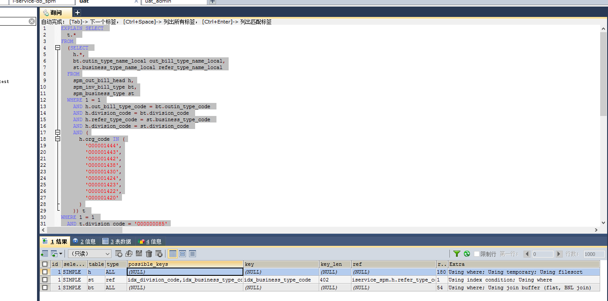

###  1建表sql

```sql
CREATE TABLE notification (
  id bigint(20) NOT NULL AUTO_INCREMENT,
  start_time date DEFAULT NULL COMMENT '开始时间',
  end_time date DEFAULT NULL COMMENT '结束时间',
  name varchar(200) DEFAULT NULL COMMENT '名称',
  compilation_date date DEFAULT NULL COMMENT '编制时间',
  info_status varchar(100) DEFAULT NULL COMMENT '状态',
  scope varchar(500) DEFAULT NULL COMMENT '发送范围',
  document varchar(500) DEFAULT NULL COMMENT '正文',
  user_account varchar(50) DEFAULT NULL COMMENT '创建人账号',
  dept_id varchar(50) DEFAULT NULL COMMENT '部门',
  create_time bigint(20) DEFAULT NULL COMMENT '创建时间',
  update_time bigint(20) DEFAULT NULL COMMENT '更新时间',
  proc_inst_id varchar(32) DEFAULT NULL COMMENT '流程实例id',
  proc_start_time bigint(20) DEFAULT NULL COMMENT '流程开始时间',
  proc_end_time bigint(20) DEFAULT NULL COMMENT '流程结束时间',
  proc_startor varchar(64) DEFAULT NULL COMMENT '流程发起人',
  proc_state varchar(30) DEFAULT NULL COMMENT '流程状态',
  proc_task_handler varchar(64) DEFAULT NULL COMMENT '流程当前处理人',
  release_time datetime DEFAULT NULL COMMENT '发布时间',
  range varchar(1000) DEFAULT NULL COMMENT '发送范围',
  isfinalized varchar(20) DEFAULT NULL COMMENT '是否已定稿',
  corp_id varchar(50) DEFAULT NULL COMMENT '单位id',
  corp_name varchar(50) DEFAULT NULL COMMENT '单位名称',
  tenant_info_id varchar(10) DEFAULT NULL COMMENT '租户ID',
  dept_name varchar(50) DEFAULT NULL COMMENT '部门名称',
  subordinate_unit_ids varchar(1000) DEFAULT NULL COMMENT '要发送给下属单位的人员账号',
  periods bigint(20) DEFAULT NULL COMMENT '期数',
  total_periods bigint(20) DEFAULT NULL COMMENT '总期数',
  periods_year bigint(20) DEFAULT NULL COMMENT '年度',
  PRIMARY KEY (id)
) ENGINE=InnoDB AUTO_INCREMENT=21123 DEFAULT CHARSET=utf8;
```


### 2 优化

#### 1  常用查询的字段加索引

~~~sql
set global profling=1;
~~~

~~~sql
show proflies
~~~

**sending Data上耗时最长**

选择区分度高的字段索引

ALTER  TABLE submit_notification  ADD INDEX corp_index(corp_id);

ALTER TABLE submit_notification  ADD INDEX  handler_index(proc_task_handler);

alter table submit_notification    add  index account_index(user_account);

#### 2 加索引调整sql

**并将or 改成union all**

```sql
EXPLAIN SELECT 
  id,
  NAME,
  compilation_date,
  info_status,
  scope,
  document,
  user_account,
  dept_id,
  proc_inst_id,
  proc_start_time,
  proc_end_time,
  proc_startor,
  proc_state,
  proc_task_handler,
  release_time,
  isfinalized,
  tenant_info_id,
  create_time 
FROM
  (
  SELECT 
    id,
    NAME,
    compilation_date,
    info_status,
    scope,
    document,
    user_account,
    dept_id,
    proc_inst_id,
    proc_start_time,
    proc_end_time,
    proc_startor,
    proc_state,
    proc_task_handler,
    release_time,
    isfinalized,
    tenant_info_id,
    create_time 
  FROM
    submit_notification n 
  WHERE  FIND_IN_SET('chengwei_01@csg.cn', subordinate_unit_ids) > 0 
      AND n.info_status = 'notify'
  UNION ALL
   SELECT 
    id,
    NAME,
    compilation_date,
    info_status,
    scope,
    document,
    user_account,
    dept_id,
    proc_inst_id,
    proc_start_time,
    proc_end_time,
    proc_startor,
    proc_state,
    proc_task_handler,
    release_time,
    isfinalized,
    tenant_info_id,
    create_time 
  FROM
    submit_notification n 
  WHERE corp_id = 'c29cd3da9458461191b5b2d5e8417346'
    AND FIND_IN_SET('总部各部门', n.range) > 0
      
   UNION ALL   
      SELECT 
    id,
    NAME,
    compilation_date,
    info_status,
    scope,
    document,
    user_account,
    dept_id,
    proc_inst_id,
    proc_start_time,
    proc_end_time,
    proc_startor,
    proc_state,
    proc_task_handler,
    release_time,
    isfinalized,
    tenant_info_id,
    create_time 
  FROM
    submit_notification where proc_task_handler = 'chengwei_01@csg.cn'
    UNION ALL
     SELECT 
    id,
    NAME,
    compilation_date,
    info_status,
    scope,
    document,
    user_account,
    dept_id,
    proc_inst_id,
    proc_start_time,
    proc_end_time,
    proc_startor,
    proc_state,
    proc_task_handler,
    release_time,
    isfinalized,
    tenant_info_id,
    create_time 
  FROM
    submit_notification where user_account = 'chengwei_01@csg.cn'
    ) t 
WHERE 1 = 1 
ORDER BY FIELD(proc_task_handler, 'chengwei_01@csg.cn') DESC,
  create_time DESC 
```

#### 3 proc_task_handler加索引

proc_task_handler区分度比较高，加索引过滤很多数据

1 将proc_task_handler拆成一条单独的sql,凑够条数就不在执行其他sql执行，这样做可以避免field函数操作proc_task_handler导致索引失效

2 分页查询，数量不够，再次执行sql,虽然拆成两条SQL，但是可以避免所以索引失效

~~~sql
EXPLAIN SELECT 
  n.id,
  n.start_time,
  n.end_time,
  n.name,
  n.compilation_date,
  n.info_status,
  n.scope,
  n.document,
  n.user_account,
  n.dept_id,
  n.create_time,
  n.update_time,
  n.proc_inst_id,
  n.proc_start_time,
  n.proc_end_time,
  n.proc_startor,
  n.proc_state,
  n.proc_task_handler,
  n.release_time,
  n.range,
  n.isfinalized,
  n.corp_id,
  n.corp_name,
  n.tenant_info_id,
  n.dept_name,
  n.periods,
  n.total_periods,
  n.periods_year 
FROM
  (SELECT 
    n.id,
    n.start_time,
    n.end_time,
    n.name,
    n.compilation_date,
    n.info_status,
    n.scope,
    n.document,
    n.user_account,
    n.dept_id,
    n.create_time,
    n.update_time,
    n.proc_inst_id,
    n.proc_start_time,
    n.proc_end_time,
    n.proc_startor,
    n.proc_state,
    n.proc_task_handler,
    n.release_time,
    n.range,
    n.isfinalized,
    n.corp_id,
    n.corp_name,
    n.tenant_info_id,
    n.dept_name,
    n.periods,
    n.total_periods,
    n.periods_year 
  FROM
    submit_notification n 
  WHERE n.info_status = 'notify'
    AND corp_id = 'c29cd3da9458461191b5b2d5e8417346' 
    OR (
      FIND_IN_SET('chengwei@csg.cn', subordinate_unit_ids) > 0 
      AND n.info_status = 'notify'
    ) 
  UNION ALL
  SELECT 
    n.id,
    n.start_time,
    n.end_time,
    n.name,
    n.compilation_date,
    n.info_status,
    n.scope,
    n.document,
    n.user_account,
    n.dept_id,
    n.create_time,
    n.update_time,
    n.proc_inst_id,
    n.proc_start_time,
    n.proc_end_time,
    n.proc_startor,
    n.proc_state,
    n.proc_task_handler,
    n.release_time,
    n.range,
    n.isfinalized,
    n.corp_id,
    n.corp_name,
    n.tenant_info_id,
    n.dept_name,
    n.periods,
    n.total_periods,
    n.periods_year 
  FROM
    submit_notification n 
  WHERE corp_id = 'c29cd3da9458461191b5b2d5e8417346'
    AND FIND_IN_SET('总部各部门', n.range) > 0

   UNION ALL	
   SELECT 
    c.id,
    c.start_time,
    c.end_time,
    c.name,
    c.compilation_date,
    c.info_status,
    c.scope,
    c.document,
    c.user_account,
    c.dept_id,
    c.create_time,
    c.update_time,
    c.proc_inst_id,
    c.proc_start_time,
    c.proc_end_time,
    c.proc_startor,
    c.proc_state,
    c.proc_task_handler,
    c.release_time,
    c.range,
    c.isfinalized,
    c.corp_id,
    c.corp_name,
    c.tenant_info_id,
    c.dept_name,
    c.periods,
    c.total_periods,
    c.periods_year 
  FROM
    submit_notification c
    WHERE c.proc_task_handler = 'chengwei@csg.cn' 	
    ) n 
WHERE 1 = 1 
ORDER BY n.create_time DESC 
LIMIT 0, 5
~~~


#### 4 长字段改成表

subordinate_unit_ids建成一个表，然后再加索引，使用索引来检索

1 可以使用缩影

2 避免数据太长特殊情况，满足不了

~~~sql
CREATE TABLE submit_unit_account(
    id BIGINT  PRIMARY KEY AUTO_INCREMENT,
    notify_id  BIGINT,
    user_account VARCHAR(50)
)ENGINE=INNODB  DEFAULT CHARSET=utf8

ALTER TABLE submit_unit_account ADD INDEX unit_account_index(user_account);
~~~

~~~sql
EXPLAIN SELECT 
  n.id,
  n.start_time,
  n.end_time,
  n.name,
  n.compilation_date,
  n.info_status,
  n.scope,
  n.document,
  n.user_account,
  n.dept_id,
  n.create_time,
  n.update_time,
  n.proc_inst_id,
  n.proc_start_time,
  n.proc_end_time,
  n.proc_startor,
  n.proc_state,
  n.proc_task_handler,
  n.release_time,
  n.range,
  n.isfinalized,
  n.corp_id,
  n.corp_name,
  n.tenant_info_id,
  n.dept_name,
  n.periods,
  n.total_periods,
  n.periods_year 
FROM
  (
  SELECT 
    n.id,
    n.start_time,
    n.end_time,
    n.name,
    n.compilation_date,
    n.info_status,
    n.scope,
    n.document,
    n.user_account,
    n.dept_id,
    n.create_time,
    n.update_time,
    n.proc_inst_id,
    n.proc_start_time,
    n.proc_end_time,
    n.proc_startor,
    n.proc_state,
    n.proc_task_handler,
    n.release_time,
    n.range,
    n.isfinalized,
    n.corp_id,
    n.corp_name,
    n.tenant_info_id,
    n.dept_name,
    n.periods,
    n.total_periods,
    n.periods_year 
  FROM
    submit_notification n 
  WHERE n.info_status = 'notify'
    AND corp_id = 'c29cd3da9458461191b5b2d5e8417346' 
  UNION ALL
  
  SELECT 
    b.id,
    b.start_time,
    b.end_time,
    b.name,
    b.compilation_date,
    b.info_status,
    b.scope,
    b.document,
    b.user_account,
    b.dept_id,
    b.create_time,
    b.update_time,
    b.proc_inst_id,
    b.proc_start_time,
    b.proc_end_time,
    b.proc_startor,
    b.proc_state,
    b.proc_task_handler,
    b.release_time,
    b.range,
    b.isfinalized,
    b.corp_id,
    b.corp_name,
    b.tenant_info_id,
    b.dept_name,
    b.periods,
    b.total_periods,
    b.periods_year 
    FROM submit_notification b 
    WHERE corp_id = 'c29cd3da9458461191b5b2d5e8417346'
    AND FIND_IN_SET('总部各部门', b.range) > 0
    
     UNION ALL
    SELECT 
    c.id,
    c.start_time,
    c.end_time,
    c.name,
    c.compilation_date,
    c.info_status,
    c.scope,
    c.document,
    c.user_account,
    c.dept_id,
    c.create_time,
    c.update_time,
    c.proc_inst_id,
    c.proc_start_time,
    c.proc_end_time,
    c.proc_startor,
    c.proc_state,
    c.proc_task_handler,
    c.release_time,
    c.range,
    c.isfinalized,
    c.corp_id,
    c.corp_name,
    c.tenant_info_id,
    c.dept_name,
    c.periods,
    c.total_periods,
    c.periods_year 
  FROM
    submit_notification c 
  WHERE
       c.info_status = 'notify'
        AND c.id IN (SELECT notify_id FROM  submit_unit_account WHERE user_account  IN('yuanling@gz.csg.cn') )
    ) n 
WHERE 1 = 1 
ORDER BY n.create_time DESC 
LIMIT 0, 5
~~~

#### 5 DEPENDENT SUBQUERY

~~~sql
SELECT 
    c.id,
    c.start_time,
    c.end_time,
    c.name,
    c.compilation_date,
    c.info_status,
    c.scope,
    c.document,
    c.user_account,
    c.dept_id,
    c.create_time,
    c.update_time,
    c.proc_inst_id,
    c.proc_start_time,
    c.proc_end_time,
    c.proc_startor,
    c.proc_state,
    c.proc_task_handler,
    c.release_time,
    c.range,
    c.isfinalized,
    c.corp_id,
    c.corp_name,
    c.tenant_info_id,
    c.dept_name,
    c.periods,
    c.total_periods,
    c.periods_year 
  FROM
    submit_notification c 
  WHERE
       c.info_status = 'notify'
       AND exists (SELECT notify_id FROM  submit_unit_account u WHERE user_account  IN('yuanling@gz.csg.cn') and u.notify_id=c.id)
       -- AND c.id IN (SELECT notify_id FROM  submit_unit_account WHERE user_account  ---  IN('yuanling@gz.csg.cn'))
~~~

改造

去除exists

~~~sql
SELECT 
    c.id,
    c.start_time,
    c.end_time,
    c.name,
    c.compilation_date,
    c.info_status,
    c.scope,
    c.document,
    c.user_account,
    c.dept_id,
    c.create_time,
    c.update_time,
    c.proc_inst_id,
    c.proc_start_time,
    c.proc_end_time,
    c.proc_startor,
    c.proc_state,
    c.proc_task_handler,
    c.release_time,
    c.range,
    c.isfinalized,
    c.corp_id,
    c.corp_name,
    c.tenant_info_id,
    c.dept_name,
    c.periods,
    c.total_periods,
    c.periods_year 
  FROM
    submit_notification c 
  WHERE
       c.info_status = 'notify'
        AND c.id IN (SELECT notify_id FROM  submit_unit_account WHERE user_account    IN('yuanling@gz.csg.cn'))
~~~

~~~sql
EXPLAIN  SELECT * FROM notification n WHERE  EXISTS 
( SELECT record_id FROM submit_browser b WHERE b.table_name='notification' AND b.is_browser=0 AND n.id=b.record_id )
~~~


### 例子2

原始sql

~~~sql
EXPLAIN SELECT 
  t.* 
FROM
  (SELECT 
    h.*,
    bt.outin_type_name_local out_bill_type_name_local,
    st.business_type_name_local refer_type_name_local 
  FROM
    spm_out_bill_head h,
    spm_inv_bill_type bt,
    spm_business_type st 
  WHERE 1 = 1 
    AND h.out_bill_type_code = bt.outin_type_code 
    AND h.division_code = bt.division_code 
    AND h.refer_type_code = st.business_type_code 
    AND h.division_code = st.division_code 
    AND (
      h.org_code IN (
        'O00001444',
        'O00001443',
        'O00001442',
        'O00001438',
        'O00001430',
        'O00001424',
        'O00001423',
        'O00001422',
        'O00001420'
      )
    )) t 
WHERE 1 = 1 
  AND t.division_code = 'O00000085'
  AND t.org_code = 'O00000085'
ORDER BY t.head_id DESC 
LIMIT 0, 15 
~~~




第一步先解决 using filesort

~~~sql
EXPLAIN
SELECT h.* FROM out_bill_head h ,
		spm_inv_bill_type bt,
		spm_business_type st
		WHERE  h.type_code = bt.type_code 
			AND h.country_code = bt.country_code 
			AND h.source_code = st.source_code 
			AND h.country_code = st.country_code 
			AND h.id IN (
 SELECT id FROM out_bill_head t WHERE  t.org_code IN (
        'O00000085',
        'O00001447',
        'O00001446',
        'O00001445',
        'O00001444',
        'O00001443',
        'O00001430',
        'O00001424',
        'O00001423',
        'O00001422')
     ORDER BY t.id DESC 
     )
~~~

第二步

**in子查询索引失效，解决办法两种1 用临时表 2 先查询结果再单独列出来**

~~~sql
EXPLAIN
// 1
SELECT id FROM out_bill_head t WHERE  t.org_code IN (
        'O00000085',
        'O00001447',
        'O00001446',
        'O00001445',
        'O00001444',
        'O00001443',
        'O00001430',
        'O00001424',
        'O00001423',
        'O00001422')
 //2       
SELECT h.* FROM out_bill_head h ,
		spm_inv_bill_type bt,
		spm_business_type st
		WHERE  h.type_code = bt.type_code 
			AND h.country_code = bt.country_code 
			AND h.source_code = st.source_code 
			AND h.country_code = st.country_code 
			AND h.id IN (1,2,3)
	          ORDER BY t.id DESC 
~~~

