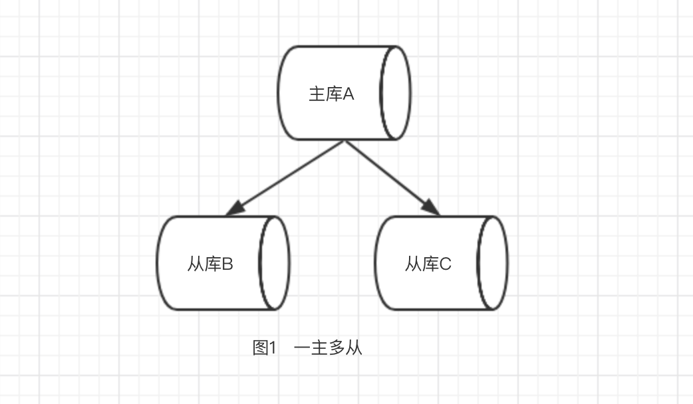
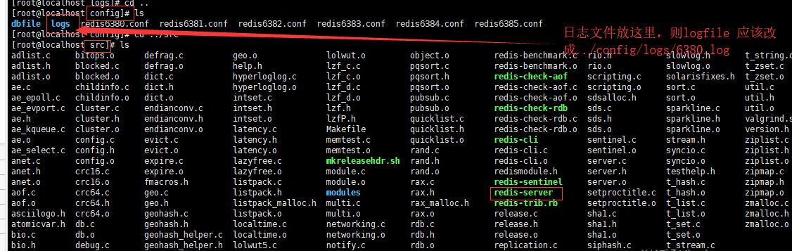

图形工具

https://gitee.com/MaxBill/RedisPlus

**命令参考**

http://redisdoc.com/hash/hlen.html

### 1 redis数据库

redis默认有16个数据库

### 2 键的过期时间

expire设置键的生成时间,pexpireat设置过期时间

### 3 过期策略

#### 3.1删除策略

1 定时删除，到时间就把所有过期的键删除

2 惰性删除，每次从键空间取键时，判断改键是否删除，过期则删除

3 定期删除，每隔一段时间去删除，限制删除的执行时长和频率

### 4 内存淘汰机制

如果定期删除漏掉了很多过期的key,也没有及时去查，大量过期的key堆积在内存里，导致redis的内存耗尽

解决办法是设置redis内存最大使用量，当内存使用量超出时，会执行内存淘汰策略

#### 4.1 内存淘汰机制

| 策略            | 描述                                                 |
| --------------- | ---------------------------------------------------- |
| volatile-lru    | 从已设置过期时间的数据集中挑选最近最少使用的数据淘汰 |
| volatile-ttl    | 从已设置过期时间的数据集中挑选将过期的数据淘汰       |
| volatile-random | 从已设置过期时间的数据集中挑选随机选择数据淘汰       |
| allkeys-lru     | 从所有数据集中挑选最近最少使用的数据淘汰             |
| allkeys-random  | 从所有数据随机选择数据淘汰                           |
| noeviction      | 禁止淘汰数据                                         |

### 5 redis持久化

#### 5.1 RDB

将某一时刻的所有数据保存到RDB文件中

有两个命令可以生成RDB文件

1 save:会阻塞redis服务进程，服务器不能接收任何请求，直到RDB文件创建完为止

2 bgsave:创建出一个子进程，由子进程创建RDB文件，服务器可以继续接收请求

除了手动调用save和bgsave命令，还可以配置定期执行

在默认的配置下，如果以下的条件被触发，就会执行`BGSAVE`命令

```text
save 900 1              #在900秒(15分钟)之后，至少有1个key发生变化，
    save 300 10            #在300秒(5分钟)之后，至少有10个key发生变化
    save 60 10000        #在60秒(1分钟)之后，至少有10000个key发生变化
```

RDB优缺点：

优点:载入数据快，文件体积小

缺点:会一定程度上丢失(当系统宕机则会数据丢失)

#### 5.2 AOF(append-only-file)

当redis执行写命令的时候，将执行写命令保存到AOF文件


AOF优缺点

优点:丢失数据少(默认数据一秒的数据)

缺点:恢复数据慢，体积大

### 6 redis单线程快的原因

1 纯内存操作

2 是基于非阻塞的IO多路复用机制

3 单线程避免了多线程频繁上下文切换的消耗


### 7 集群 的主从复制

主服务器:master

从服务器:replica(slave)

主从复制的实现本质就是通过socket把**主服务器**的**RDB文件**传输到**从服务器**上，


### 8 哨兵机制（sentinal）

哨兵机制用于实现redis的高可用性,功能如下:

1 sentinal监控redis主从服务器是否正常工作

2 如果某个Redis实例有故障，那么哨兵负责**发送消息通知**管理员

3 如果主服务器挂掉了，会**自动**将从服务器提升为主服务器(包括配置都会修改)

4 Sentinel可以作为**配置中心**，能够提供当前主服务器的信息

```java
/org/findAllParents  id  mindjet MindManager
```


### 9 lua

https://blog.csdn.net/fly910905/article/details/78955343

redis会保证lua脚本执行的原子性

~~~tex
Also Redis guarantees that a script is executed in an atomic way: no other script or Redis command will be executed while a script is being executed. This semantic is similar to the one of MULTI / EXEC
~~~

在分布式锁或者分布式事务时会用到lua脚本来保证原子性，这个暂时空缺出来

### 10 分布式锁

zokeeper分布式锁

**https://blog.csdn.net/qiangcuo6087/article/details/79067136**

基于redis实现分布式锁的机制，主要是依赖redis自身的原子操作

使用setnx命令

```shell
set  key  value NX PX 30000
```

分布式锁

http://ifeve.com/redis-lock/

http://developer.51cto.com/art/201812/588335.htm

https://github.com/redisson/redisson/wiki/8.-分布式锁和同步器


注意看，上面的步骤(3)-->步骤(4.1)并不是**原子性操作**。也就说，你可能出现在步骤(3)的时候返回的是有效这个标志位，但是在传输过程中，因为**延时等原因**，在步骤(4.1)的时候，**锁已经超时失效了**。那么，这个时候锁就会被另一个客户端锁获得。就出现了两个客户端共同操作共享资源的情况

**redis的主从复制是异步，给有可能出现master节点宕机了，slave来不及同步数据就被选为master,从而导致数据丢失**

具体流程如下:

1 客户端1从master获取锁

2 master宕机了，存储锁的key还没来得及同步到slave上

3 slave升级为master

4 客户端2 从新的master获取对应的同一资源锁

解决办法

**redLock算法**


### 11 分布式事务

**不保证原子性，一条命令执行失败，其他命令继续执行**

// 先加锁监控

watch

//开始事务

multi

提交的命令加入任务队列，但是没有加锁

// 原子操作

exec

exec命令在key在watch监视加锁的情况没有被改动才能执行成功，否则会事务回滚

// 取消监控，放弃锁

unwatch

//监控加锁

watch

multi

exec

### 12安装

1 解压压缩包

tar -zxvf redis-xxx.tar.gz

2 执行maker命令安装

  ~~~sh
make
  ~~~

3 若没有gcc命令则需要安装

gcc是linux是一个编译程序

 安装方法

1 上网

~~~shell
yum install gcc-c++
~~~

2 本地安装gcc

// todo

### 13 配置和启动redis

#### 13.1配置redis

1 修改redis.conf文件，设置redis线程为守护线程  

~~~properties
daemonize yes
~~~

 **查找启动的redis进程命令**

~~~shell
ps -ef|grep redis
~~~

#### 13.2 启动redis

~~~shell
./redis-server ../redis.conf
~~~

#####  redis-cli

~~~shell
redis-cli -p 6379
~~~


### 14 基础知识

1 redis是单线程(指处理读写请求是使用单线程,不止一个线程)

2 使用多路IO复用模型

3 对读写等事件的响应是通过epoll函数的包装来实现的，Epoll是linux内核为处理大批量文件描述而改进的epoll,是linux下多路复用IO接口select/poll的增强版本

4 select index切换数据库 

例子

~~~shell
select 7  --(第8个数据库的下表是7)
~~~

#### 5 DBSIZE

查看当前数据库有多少key

~~~shell
keys *  --查看当前数据库所有的key
~~~

#### 6 清空当前数据库的key

~~~shell
FLUSHDB
FLUSHALL --清空所有数据库的key
~~~

### 数据类型

整个redis是数据类型本质都是string

#### hash

hset--每个key-value的时间复杂的是O(1),N个O(N)

KV模式不变，但V是一个键值对

**hset、hget、hmset、hmget、hgetall、hdel**

例子

~~~shell
hset user id 11
hget user id
~~~


hmset(其中的m是more的意思)


hdel是删除key


hlen key--返回key的数量

hkeys --返回一个hash中key包含所有的key,等同于获取map中所有的key

hvals --返回hash中包含的所有value,等同于获取map中所有的values

hincrby customer age 2 --表示customer.age属性增加2，该操作是原子操作

hincrbyfloat customer score 0.5 -- 表示customer.score 属性增加0.5，该操作是原子操作

hsetnx key  value --当key不存在则创建一个，否则什么也不做，返回值0表示false,1表示true

#### sorted set

sorted set是有序集合

#### 字符串

set--时间复杂度是O(1)

getset

getset key value--和set一样可以设置，但是会返回旧值，如果key不存在则返回nil

append

append  key  value

在末尾追加字符串

incr

在原有基础上加1，并返回运算后的值，即加1之后的值,**本操作的值限制在 64 位(bit)有符号数字表示之内**

incr key

incrby 

在原数值基础加指定的值

incrby key  increment

incrbyflot key increment

decr

decrby 

mset

mset和set命令类似，set是单个key操作，mset是多个key操作，set返回成功ok,加上nx会返回nil,mset返回1和0，setnx也是返回1和0

#### 列表

列表从左到右，左边是表头，右边是表尾，left是左边，right是右边，push是插入操作，pop是删除，lrange是取数操作，

lpush

rpush

lpop

blpop--阻塞版本，通过timeout来完成阻塞

rpop

brpop--阻塞版本,通过timeout来完成阻塞

llen

lindex

lset--对列表指定下标的元素修改

linsert

blpop

brpop

#### 集合

sadd--增加元素，支持多个同时操作

sismember--判断集合是否有目标元素

sismember key value

smembers--列出集合的所有元素

smove--集合之间的元素移动的原子操作，成功则返回1，不含该元素则返回0

smove  source dest member--source删除元素，dest增加元素

spop--随机集合的一个元素

srem--(set remove member)--删除指定的一个或多个元素

scard--返回集合的个数，==size()

sinter--给定集合中求交集

sinterstore--在sinter的基础上求交集的同时，将交集结果存到指定集合中

sinterstore  dest key[key...]

sunion--求并集

sunion key1 key2...

sdiff--求差集

sdiffstore--求差集并存储

#### 有序集合

有序集合维护一个score值来保证集合的有序

zadd 

zadd key score member

zscore key member --获取score

zincrby key increment member --对key的member的score值进行增减操作，increment 为负值时就是减操作

zcard key--相当于size

zcount key min max--返回score值在mix和max之间的元素个数,包含min和max

zrange key start stop [withscores]--返回start和stop之间的元素，withsocres表示是否返回score,注意:这里是包含stat和stop的，**-1表示倒数第一，-2表示倒数第二个**

zrevrange key start stop [withscores]:倒序返回

zrangebyscore key min max withscores:这里的mix指的是score的值，max也是，都是包含在内，zrange的start和stop指的是集合中的下标

zrank key member:返回元素按照score值的排名，即在集合的下标

zrevrank key member:是反过来的下标，**即表头和表尾呼唤，表头和表尾的下标也呼唤**

zrem key member:删除指定的元素

zremrangebyrank key start stop:删除指定下标区间的元素,-1表示最后一个元素

zremrangebyscore key min max:删除指定score区间值的元素

zunionstore dest  numberkeys key1 key2...---求集合并集，numberkeys指定要合并的集合的数量

zinterstoer dest numbers key1 key2...--求集合交集，numberkeys和zunionstore一样，dest是交集之后的结果

#### scan


### 配置文件

配置文件的修改有两种1 是用命令config set  propeties value

2 修改配置文件

#### includes包含

例子:包含其他的配置文件

include /path/to/local.conf

#### general

##### 日志级别

debug,verbose,notice,warning

timeout 表示客户端限制多长时间关闭该连接，**值为0表示关闭该功能，即该客户端永远不关闭**

dir 设置本地数据库的存放目录

#### SNAPSHOTTING(快照)

#### SECURITY

设置密码

config  set  requirepass "123456"

验证密码

auth  password

#### limits

Maxclients

Maxmemory

Maxmemory-policy

缓存的过期策略

Maxmemory-samples

### AOF


### RDB


### 乐观锁


### 悲观锁

当需要修改数据是会被阻塞知道拿到锁为止，例如表锁、行锁、写锁，在操作之前先上锁


### 主从复制

http://redisdoc.com/topic/index.html

1 复制粘贴几个配置文件

2 修改配置文件

3 学习一个命令 info  repliation

4 slaveof host port

#### 复制原理

slave启动成功连接到master后发送一个sync命令

Master接到命令后启动后台的存盘进程，同时收集所有接收的用于**修改数据集命令**

在后台进程执行完毕之后，master将传送整个数据文件到slave,完成一次完全同步

全量复制:slave服务在接收到数据文件后，将数据文件写到硬盘并加载到内存中

增量复制:Master继续将新的所有收集到的修改命令依次传给slave，完成同步

#### 哨兵机制

1 自定义sentinel.conf文件,**文件名不能出错**

文件内容

~~~properties
sentinel  monitor host6379 127.0.0.1 6379 1 --最后一个是表示Master宕机之后，slave得票多少才能成为master
~~~

2 启动sentinel

~~~shell
redis-sentinel ../src/sentinel.conf  --配置sentinel文件的路径
~~~

master宕机启动之后会变成slave,(sentinel会将master设置成slave)

分布式锁才是重点，今晚要搞定

### 序列化器

redis默认的序列化器是 JdkSerializationRedisSerializer ，另外还有 Jackson2JsonRedisSerializer 和 KryoRedisSerializer ，修改默认的redis的序列化器就是在初始化redisTemplate时设置指定的序列化器

~~~java
@Bean
public RedisTemplate redisTemplate(JedisConnectionFactory connectionFactory) {
        RedisTemplate redisTemplate = new RedisTemplate();
        redisTemplate.setConnectionFactory(connectionFactory);

        // 使用Jackson2JsonRedisSerialize 替换默认序列化
        Jackson2JsonRedisSerializer jackson2JsonRedisSerializer = new Jackson2JsonRedisSerializer(Object.class);

        ObjectMapper objectMapper = new ObjectMapper();
        objectMapper.setVisibility(PropertyAccessor.ALL, JsonAutoDetect.Visibility.ANY);
        objectMapper.enableDefaultTyping(ObjectMapper.DefaultTyping.NON_FINAL);
        jackson2JsonRedisSerializer.setObjectMapper(objectMapper);

        // 设置value的序列化规则和 key的序列化规则
        redisTemplate.setValueSerializer(jackson2JsonRedisSerializer);
        redisTemplate.setHashValueSerializer(jackson2JsonRedisSerializer);
        redisTemplate.setKeySerializer(new StringRedisSerializer());
        redisTemplate.setHashKeySerializer(redisTemplate.getKeySerializer());
        redisTemplate.afterPropertiesSet();

        return redisTemplate;
}
~~~

### String VS Hash

https://www.jianshu.com/p/4537467bb593

### 安装配置

1 下载解压

2 执行make命令

3 修改reids.conf配置文件

3.1 daemonize改为yes,改为yes表示redis进程可以后台运行，关闭窗口后不会关闭进程

### RedisTemplate

https://www.jianshu.com/p/7bf5dc61ca06/ 	

​	

### protected-mode

默认是yes，即开启。设置外部网络连接redis服务，设置方式如下：

1、关闭protected-mode模式，此时外部网络可以直接访问

2、开启protected-mode保护模式，需配置bind ip或者设置访问密码

### 设置远程访问

1.注释掉bind 127.0.0.1;在地址前面加个#；

2.设置密码，在#requirepass foobared去掉#号变requirepass foobared;foobared是密码;

3.protected-mode 设置成no;修改后是protected-mode no;

### 集群模式

https://www.jianshu.com/p/8e1ed39fdab3

https://blog.csdn.net/Aquester/article/details/50150163

1 一主多从


2  sentinel模式


3 cluster模式

### rehash

https://mp.weixin.qq.com/s/fRtxp-ivEqWfa3kN0EZ3MQ

**由于Redis使用的是渐进式rehash机制，因此，scan命令在需要同时扫描新表和旧表，将结果返回客户端**

### 复制

https://www.cnblogs.com/wdliu/p/9407179.html

https://www.jianshu.com/p/532149db7650

1 redis使用异步复制

2 master和slave是一对多的关系

3 复制过程是非阻塞的

**当master和slave断开连接，slave会自动重连master，当master收到多个slave同步请求的请求，master会执行一个单独的后台线程**

####  主从复制的方式

1 一主多从



2 链式主从复制


#### 工作流程

1 每个master都有一个replication ID(随机字符串),维持一个偏移量(offset)

2 slave连接到master，发送psync命令来发送记录上一次的replacation ID和offset

#### 全量同步

1 master开启一个后台保存进程，生成RDB文件流，同时缓存所有从客户端接收到的新的写入命令

2 当后台进程保存完成时，master将数据文件传输给slave,slave将之保存到磁盘里，然后加载文件到内存

3 master以指令流的形式把缓存的写入命令发送给slave

### info

http://blog.itpub.net/15498/viewspace-2644200/

###  集群模式

#### 1 一主多从

##### 搭建步骤

1  创建两个文件夹

~~~shell
mkdir  {logs,dbfile}
~~~

2 将redis.conf文件拷贝三份

~~~shell
cp  ./redis.conf  ./config/redis6380.conf
cp  ./redis.conf  ./config/redis6381.conf
cp  ./redis.conf  ./config/redis6382.conf
~~~

3 修改配置文件

**注意：这里的路径需要注意的指定的文件路径要从src/redis-server起算，例如日志文件在src同级别的config目录下的logs文件夹，则日志的文件的路径应该写"../config/logs/6380.log",数据文件的路径也是类似,最后一点，当bind的ip和真实ip不一致则启动不了，并且没有日志没有提示**

参考下图




~~~shell
daemonize yes   #修改redis为后台运行模式

pidfile /var/run/redis_6379.pid  #修改运行的redis实例的pid，不能重复

logfile "/opt/db/redis6379/6379.log"  #指明日志文件，注意：这里的路径需要注意的指定的文件路径要从src/redis-server起算，例如日志文件在src同级别的config目录下的logs文件夹，则日志的文件的路径应该写"../config/logs/6380.log"

dir "/opt/db/redis6379"   #工作目录，存放持久化数据的目录

bind 10.1.210.69   #监听地址，如果是单机多个示例可以不用修改

port 6379         #监听端口，保持和配置文件名称端口一致
~~~

4 设置主从关系、验证主从同步

问题点

修改怎么办

​	过程

​		1 每个master都有一个replication ID和offset

​		 2 当slave连接到master,先是向主服务器发送ping 命令，主服务器回应pong

​			使用psync命令发送上一次同步的replication ID和offset，当切换master的时候，replication ID不一致，从开始全量同步，否则根据偏移量进行同步

​		全量同步

​		master开启一个后台进程生成RDB文件，在保存完成后master会将数据集文件传给slave,slave接收并保存在硬盘上，slave再从硬盘中加载到内存，在保存RDB文件同时mater会将新接收到的写入命令缓存起来，在发送完RDB文件之后发送缓存起来的写入命令，同时master会将本次的偏移量发送给slave,slave将本次同步的偏移量记录下来，下次同步是发送偏移量给master，master通过比较当前的偏移量和slave的偏移量的差值进行增量同步


在服务器正在做一些工作的同时连接到 Redis 端口并发出 [SYNC](https://redis.io/commands/sync) 命令。你将会看到一个批量传输，并且之后每一个 master 接收到的命令都将在 telnet 回话中被重新发出。事实上 SYNC 是一个旧协议，在新的 Redis 实例中已经不再被使用，但是其仍然向后兼容：但它不允许部分重同步，所以现在 **PSYNC** 被用来替代 SYNC

**全量同步过程也可以没有磁盘的参与，即slave不保存文件到硬盘，直接加载到内存,在redis.conf配置文件中的repl-diskless-sync参数设置是否把接收到的RDB文件保存到硬盘**

**repl-diskless-sync-delay 参数可以延迟启动数据传输，目的可以在第一个 slave就绪后，等待更多的 slave就绪**

​		增量同步

全量同步完成后，master默认10秒(通过repl-ping-slave-period修改默认值)想salve发送PING命令判断slave命令是否在线，slave默认是1秒向master发送REPLCONF ACK(REPLCONF ACK {offset})上一次的同步的偏移量和replication ID

**从2.6版本开始，slave支持只读模式且默认开启，在redis.conf文件修改slave-read-only配置来设置是否只是只读，只读模式下拒绝所有写入命令**

##### redis没有开启持久化的危险性

1 设置节点A为master,节点B、C为slave,节点A关闭持久化

2 节点A崩溃，然后自动重启，因为没有持久化，节点A的数据被清空

3 节点B和节点C从节点Amaster(sentinel模式下节点A下线后，会被切换为slave)复制数据，节点A发送一个空数据集，节点B、C同样被清空

##### 主从复制过期key的处理

Redis处理key过期有惰性删除和定期删除两种机制，而在配置主从复制后，slave服务器就没有权限处理过期的`key`，这样的话，对于在master上过期的key，在slave服务器就可能被读取，所以master会累积过期的key，积累一定的量之后，发送del命令到slave，删除slave上的key

##### 复制积压缓冲区

**.replication backlog buffer（复制积压缓冲区）：**

　　复制积压缓冲区是一个固定长度的FIFO队列，大小由配置参数repl-backlog-size指定，默认大小1MB。需要注意的是该缓冲区由master维护并且有且只有一个，所有slave共享此缓冲区，其作用在于备份最近主库发送给从库的数据。

　　在主从命令传播阶段，主节点除了将写命令发送给从节点外，还会发送一份到复制积压缓冲区，作为写命令的备份。除了存储最近的写命令，复制积压缓冲区中还存储了每个字节相应的复制偏移量（如下图），由于复制积压缓冲区固定大小先进先出的队列，所以它总是保存的是最近redis执行的命令

#### 2 sentinel模式

#### 运行Sentinel

运行sentinel有两种方式：

- 第一种

  ```
  redis-sentinel /path/to/sentinel.conf
  ```

- 第二种

  ```
  redis-server /path/to/sentinel.conf --sentinel
  ```

  以上两种方式，都必须指定一个sentinel的配置文件sentinel.conf，如果不指定，将无法启动sentinel。sentinel默认监听26379端口，所以运行前必须确定该端口没有被别的进程占用

#### 2.1 sentinel3个定时任务

1 每10秒每个sentinel节点对master节点和slave节点执行info操作


2  每2秒每个sentinel节点通过master节点的channel（**sentinel**:hello）交换信息


3 每1秒每个sentintel节点对master节点和slave节点以及其余的sentinel节点执行ping操作


#### 2.2 故障转移

一次故障转移操作由以下步骤组成：

- 发现主服务器已经进入客观下线状态。
- 对我们的当前纪元进行自增（详情请参考 Raft leader election ）， 并尝试在这个纪元中当选。
- 如果当选失败， 那么在设定的故障迁移超时时间的两倍之后， 重新尝试当选。 如果当选成功， 那么执行以下步骤。
- 选出一个从服务器，并将它升级为主服务器。
- 向被选中的从服务器发送 `SLAVEOF NO ONE` 命令，让它转变为主服务器。
- 通过发布与订阅功能， 将更新后的配置传播给所有其他 Sentinel ， 其他 Sentinel 对它们自己的配置进行更新。
- 向已下线主服务器的从服务器发送 [SLAVEOF](http://www.redis.cn/commands/slaveof.html) 命令， 让它们去复制新的主服务器。
- 当所有从服务器都已经开始复制新的主服务器时， 领头 Sentinel 终止这次故障迁移操作。

每当一个 Redis 实例被重新配置（reconfigured） —— 无论是被设置成主服务器、从服务器、又或者被设置成其他主服务器的从服务器 —— Sentinel 都会向被重新配置的实例发送一个 CONFIG REWRITE 命令， 从而确保这些配置会持久化在硬盘里

#### 2.3 sentinel选举

1 被标记为主观下线、已断线、或最后一次回复ping命令的时间大于5秒的从服务器都被淘汰

2 与失效主服务器连接断开的时长超过down-after-milliseconds指定的时长超过10倍的都被淘汰

3 从1，2剩下的从服务中选择偏移量最大的，如果偏移量不可用或偏移量相同，最新运行ID的成为新的主服务器

4 选取出主服务器后，sentinel向被选举的从服务器发送slave no one ,让它转变为从服务器

5 通过发布与订阅功能，将更新后的配置传播给所有其他的sentinel

6 向其他服务器发送slave of ,让它复制新的主服务器


选举规则

1. sentinel首先会根据slaves的优先级来进行排序，优先级越小排名越靠前（？）。
2. 如果优先级相同，则查看复制的下标，哪个从master接收的复制数据多，哪个就靠前。
3. 如果优先级和下标都相同，就选择进程ID较小的那个

####  2.4 sentinel持久化


####  TILT 模式

Redis Sentinel 严重依赖计算机的时间功能： 比如说， 为了判断一个实例是否可用， Sentinel 会记录这个实例最后一次相应 PING 命令的时间， 并将这个时间和当前时间进行对比， 从而知道这个实例有多长时间没有和 Sentinel 进行任何成功通讯。

不过， 一旦计算机的时间功能出现故障， 或者计算机非常忙碌， 又或者进程因为某些原因而被阻塞时， Sentinel 可能也会跟着出现故障。

TILT 模式是一种特殊的保护模式： 当 Sentinel 发现系统有些不对劲时， Sentinel 就会进入 TILT 模式

因为 Sentinel 的时间中断器默认每秒执行 10 次， 所以我们预期时间中断器的两次执行之间的间隔为 100 毫秒左右。 Sentinel 的做法是， 记录上一次时间中断器执行时的时间， 并将它和这一次时间中断器执行的时间进行对比：

- 如果两次调用时间之间的差距为负值， 或者非常大（超过 2 秒钟）， 那么 Sentinel 进入 TILT 模式。
- 如果 Sentinel 已经进入 TILT 模式， 那么 Sentinel 延迟退出 TILT 模式的时间

#### 2.5 Sentinel API

Sentinel默认运行在26379端口上，sentinel支持redis协议，所以可以使用redis-cli客户端或者其他可用的客户端来与sentinel通信。

有两种方式能够与sentinel通信：

- 一种是直接使用客户端向它发消息
- 另外一种是使用发布/订阅模式来订阅sentinel事件，比如说failover，或者某个redis实例运行出错

#### 2.6 sentinel failover-timeout

failover-timeout通常被解释成故障转移超时时间，但实际上它作用于故
障转移的各个阶段：
a）选出合适从节点。
b）晋升选出的从节点为主节点。
c）命令其余从节点复制新的主节点。
d）等待原主节点恢复后命令它去复制新的主节点

#### 3 cluster模式

1 hash slot

  具体的分片分区的思想

2 重新分片

3 增删节点

而是引入了 **哈希槽**的概念.

Redis 集群有16384个哈希槽,每个key通过CRC16校验后对16384取模来决定放置哪个槽.集群的每个节点负责一部分hash槽,举个例子,比如当前集群有3个节点,那么:

- 节点 A 包含 0 到 5500号哈希槽.
- 节点 B 包含5501 到 11000 号哈希槽.
- 节点 C 包含11001 到 16384号哈希槽.

这种结构很容易添加或者删除节点. 比如如果我想新添加个节点D, 我需要从节点 A, B, C中得部分槽到D上. 如果我想移除节点A,需要将A中的槽移到B和C节点上,然后将没有任何槽的A节点从集群中移除即可. 由于从一个节点将哈希槽移动到另一个节点并不会停止服务,**所以无论添加删除或者改变某个节点的哈希槽的数量都不会造成集群不可用的状态**

#### 主从复制模型

为了使在部分节点失败或者大部分节点无法通信的情况下集群仍然可用，所以集群使用了主从复制模型,每个节点都会有N-1个复制品

#### 一致性保证

Redis 并不能保证数据的**强一致性**. 这意味这在实际中集群在特定的条件下可能会丢失写操作.

- 客户端向主节点B写入一条命令.
- 主节点B向客户端回复命令状态.
- 主节点将写操作复制给他得从节点 B1, B2 和 B3.

主节点对命令的复制工作发生在返回命令回复之后， 因为如果每次处理命令请求都需要等待复制操作完成的话， 那么主节点处理命令请求的速度将极大地降低 —— 我们必须在性能和一致性之间做出权衡。 注意：Redis 集群可能会在将来提供同步写的方法。 Redis 集群另外一种可能会丢失命令的情况是集群出现了网络分区， 并且一个客户端与至少包括一个主节点在内的少数实例被孤立

**注意， 在网络分裂出现期间， 客户端 Z1 可以向主节点 B 发送写命令的最大时间是有限制的， 这一时间限制称为节点超时时间（node timeout）， 是 Redis 集群的一个重要的配置选项**

#### 集群搭建

1 集群搭建最少的配置是3主3从

2  首先启动6个redis服务

3 使用redis-trib命令行工具编写节点配置文件

4

### 集群重新分片


#### 添加一个新节点


##### 添加一个从节点

有两种方法添加从节点，可以像添加主节点一样使用redis-trib 命令，也可以像下面的例子一样使用 –slave选项:

~~~shell
./redis-trib.rb add-node --slave 127.0.0.1:7006 127.0.0.1:7000
~~~


#### 删除一个节点


### 配置文件
